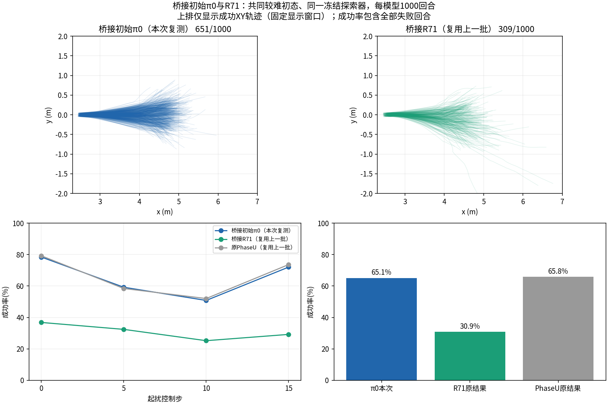

> 精简结果快照：按用户要求未附逐回合数据、轨迹数组或权重。原始目录见包根目录 SOURCE_MANIFEST.json。训练状态以包根 README 为准。

# 桥接初始π0复测与R71对照

## π0复测：直接结论

本次直接加载桥接初始π0的transition_0 checkpoint，新跑1000计分回合，成功651次（65.1%）。R71复用上次相同初态库、探索器与种子的309/1000（30.9%）；下降34.2个百分点。四个起扰组均下降。

| 起扰控制步 | π0（本次，分母250） | R71（复用，分母250） |
|---|---:|---:|
| 0 | 196/250 (78.4%) | 92/250 (36.8%) |
| 5 | 148/250 (59.2%) | 81/250 (32.4%) |
| 10 | 127/250 (50.8%) | 63/250 (25.2%) |
| 15 | 180/250 (72.0%) | 73/250 (29.2%) |

同编号初态/采样种子配对：R71新增84次成功、丢失426次，双方均成功225次；按起扰组分层10000次配对bootstrap差值95%区间[-38.0,-30.3]个百分点，仅反映固定模型回合抽样。共同探索器依赖实际状态，实际扰动不同，因此是共同闭环施扰协议下的能力比较，不是同外力反事实或生成模块单因素消融。

### π0究竟是哪一个模型

桥接π0来自原PhaseU transition_4988928，经运行配置绑定保存为bridge_baseline/checkpoints/transition_0；Actor、normalizer、critic参数哈希相同，初始化无训练。这纠正了可能的命名混淆：上一批原PhaseU实际已经评价了同参数策略，本次是桥接保存路径的直接复测。见[身份对照](identity_comparison.json)。

直接π0 65.1%与旧PhaseU65.8%相差0.7个百分点，33个回合成功标签不同。全部四组初始qpos/qvel、首步base action和请求扰动逐值一致；首步物理qpos最大差约1.7–3.2e-6，qvel约1.5–4.2e-4，表明重复运行存在物理数值分叉。不能将0.7个百分点称为模型训练变化，也不声称逐轨迹精确等价。[数值核对](repeat_numerical_diagnostics.json)。

结论：在本较难初态/共同探索器协议下，R71未保留π0的整体抗扰表现；局部新增成功不足以抵消丢失。应优先建立π0成功工况保留检查与失败定向修复；本轮未改训练、未停现有训练，也未更换R71为后续轮次。

新增物理预算已完成5批500000控制转移（1000计分+250同条件名义副本），零训练；另两组各1000回合复用历史结果，不能重复计为新增仿真。名义副本不计入计分分母。[原始比较JSON](comparison.json) · 比较脚本（原始目录保留，精简包未附） · [协议声明](declaration.json)。

---

# 桥接π0直接复测与R71对照

成功率（原始目录保留，精简包未附）

全部模型共享初态、冻结探索网络和采样种子；0/5/10/15步各250回合，±0.25持续3步。姿态、位置、速度范围及模型checkpoint见[声明](declaration.json)与[模型身份](models.json)。稳定恢复成功标准不变：有效落地后保持25步/.5秒；最长400步/.02秒。所有失败计入1000分母。

实际施扰幅度（原始目录保留，精简包未附）

## 结果（π0为本次新增，另外两组复用上一批原件）

- **Phase U（4,988,928步）：658/1000，65.8%**。XY/XZ/YZ轨迹（原始目录保留，精简包未附） · 离地对齐（原始目录保留，精简包未附） · 12维成功包线（原始目录保留，精简包未附） · 相对名义12维（原始目录保留，精简包未附）
- **桥接初始π0（直接加载）：651/1000，65.1%**。XY/XZ/YZ轨迹（原始目录保留，精简包未附） · 离地对齐（原始目录保留，精简包未附） · 12维成功包线（原始目录保留，精简包未附） · 相对名义12维（原始目录保留，精简包未附）
- **Generative bridge R71 student：309/1000，30.9%**。XY/XZ/YZ轨迹（原始目录保留，精简包未附） · 离地对齐（原始目录保留，精简包未附） · 12维成功包线（原始目录保留，精简包未附） · 相对名义12维（原始目录保留，精简包未附）

## 边界

桥接组测试声明时最新完整R71的冻结学生Actor；生成器不在评价中在线救援。探索网络/随机探索组指不同训练来源；本次所有模型均接受同一个冻结探索网络施扰。网络依赖实际状态，因此请求扰动与限幅后的扰动都可能不同；逐回合CSV记录实际幅度，不能声称等强度。

每模型250个无扰动副本仅一个独特条件，不计入1000回合；lane0为预先固定画图参考。相同初态副本可因仿真数值差异分叉，summary保留首步差异与副本成功数，不能当作250个独立初态证据。相对参考图只计算双方都有效的时刻，名义终止后不外推。

包线为成功轨迹的经验分布；5/50/95百分位每时刻至少20样本才画。终止后不补点，不以凸包或各维宽度乘积宣称能力体积。综合抗扰性以本声明分布的成功概率衡量。回合Wilson区间不代表多训练种子泛化。起扰步相对reset而非离地，初始x随机改变跳跃信号进入时刻。旧图初态、样本量和批容量不同，本次只能检验该较难协议下的性能，不能把全部差异归因于单个初态变量。

逐回合CSV（原始目录保留，精简包未附） · [原始统计JSON](summary.json) · [运行状态](status.json)

## 后续：12维成功包线量化

[事件对齐、等量成功样本的范围指数与联合覆盖](../success_envelope_quantification_20261010/INDEX.md)：π0=100、桥接R71=109.6；这是成功轨迹典型宽度，不是可控体积。
