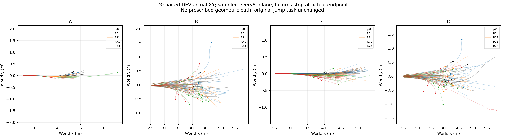
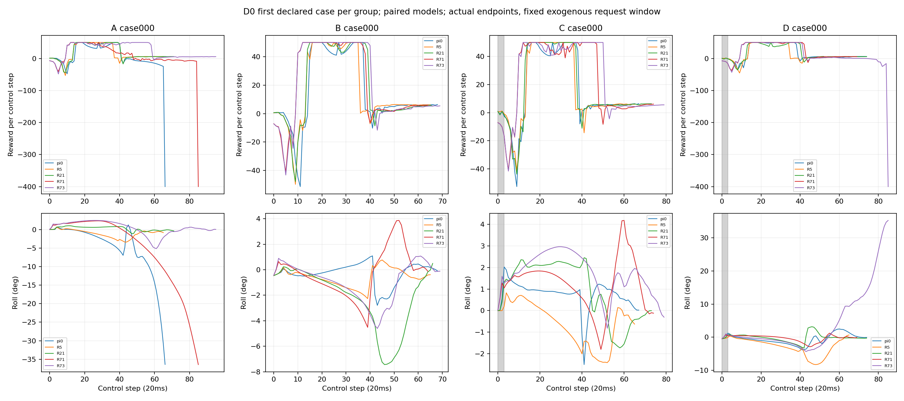

# π0保留性修复：D0/D0b（2026-10-10）

D0/D0b已完成，0训练更新；原R74失败状态保留，没有从R73续训。π0是桥接transition_0，Actor a06acbc8、normalizer db84aad7、critic 5b864131；与PhaseU transition_4988928一致。R5/R21/R71/R73均实算身份，见[输入身份](model_identity_audit.json)。采集执行代码991c7d1，原250-world布局/400步/奖励/成功标准保持；分析及调度修复提交见本目录Git历史。

A=名义初态无扰动；B=随机初态无扰动；C=名义初态固定请求残差；D=随机初态同请求残差。A仅一个独特初态重复64次；B/C/D各128，四onset0/5/10/15各32，L3，四通道±.25预生成uniform请求，B/D初态配对、C/D请求配对。实际限幅及轨迹可以不同。全部是DEV，祖先与后续TRAIN/TEST隔离。

|模型|A /64|B /128|C /128|D /128|B/C/D新增|B/C/D丢失|净差|
|---|---:|---:|---:|---:|---:|---:|---:|
|π0|49|105|89|89|0|0|0|
|R5|64|114|127|100|87|29|+58|
|R21|64|96|123|88|81|57|+24|
|R71|60|44|87|35|45|162|−117|
|R73|62|27|91|31|46|180|−134|

A的增失是同名义条件的重复执行标签，不称独特能力；以上净差是本次配对DEV观察，不是独立训练重复或老师转化。晚期策略已在无扰动B明显退化，因此自适应E不能解释全部损失；早期R5有开发正向结果，但未采用、不构成同预算算法优势。

[π0复制/导出审计](D0b_audit.json)：4096冻结观测，Actor/normalizer/critic身份一致，动作及导出差异0；三帧FIFO、观测连续性与25步成功计数检查无异常。禁止Actor梯度后，仅执行normalizer更新，最大动作变化.000577；[Actor×normalizer交叉审计](normalizer_actor_factorial.json)中仅换R73 normalizer最大变化.6868。二者诊断范围不同，均不直接证明物理因果。

[重复执行](repeat_first_differences.json)：π0/R71各32独特物理条件，每条件3次，选定代表组各有2/32标签翻转；原冗余名义重复及其更多翻转保留在完整本地结果。不能因小面板一致或“不显著”声明不退化。20ms帧分辨率下，离地诊断先见接地再连续3帧轮间隙>.01m，不把初始3cm悬空算跳跃；不冒充物理子步离地。

[真实历史Actor梯度/KL](historical_actor_gradients.json)：R73最新raw PPO/demo/keep范数14.0519/.1165/.1116，keep系数.2；PPO/demo余弦−.7909、PPO/keep.1618，behavior KL.01266。PPO minibatch与固定辅助探针分布不同；不按含critic总loss大小调整权重，不把.01266称数值发散。

新增opt-in代码在冻结normalizer全部状态时，lambda_demo必须用显式已完成采样transitions（stage-local env_steps）；原normalizer.count调度保留给旧协议。通过CPU固定统计量/时钟推进、已安装Brax布局及完整learner hook组合测试；没有新学生训练或能力修复证明。

原自适应E压力结果保留651/1000→309/1000；原始NPZ首次异常另在本地报告核算：π0物理失败飞行5/接触后344，R71飞行130/接触后560，另1个未物理失败的非成功回合；不能只看终止码称落地机制。禁止接触也有接触前发生。标签不重标。

预算：主2240回合、重复234回合；14个250容量批含终止后/padding计费1,400,000≤1,500,000，原4h窗口内。原12批报告因normalized obs字典字段错误失败，partial记录保留；仅修分析，不重测主面板。原重复32case IDs实际25独特条件，预声明补7×3×2模型，追加200,000；全部保留、不筛失败。

[固定π0/E/G的D1准备](D1_preparation.json)仅锁定版本、独立TRAIN祖先和16→至多32root上限；actual-layout dry-run待完成，不可执行、未启动。每TRAIN root必须从同后扰动快照独立测π0：π0会而学生不会=retention_debt；π0不会、老师可靠救回、学生独立学会才是相对π0新增。D0没有老师搜索，所以同根老师—学生转化矩阵为NOT_EXECUTED，不能拿上表填它。三学生臂未执行；全部拟从同π0副本开始，learner_last/best_dev_candidate/published_policy分开。

完整条件JSON、逐回合CSV/奖励分项、原始NPZ、请求表、预算与修正记录保留服务器：`/home/qy/DVGC/JIT/runs/experiments/retention_first_20261010/D0_002/report_0005/INDEX.md`；原plan、14批NPZ在其父目录及repeat_completion_001。本文只打包精简可审计汇总，不含权重。下一步仅准备并审查独立TRAIN老师试点；本轮不自动升级D1–D3。
