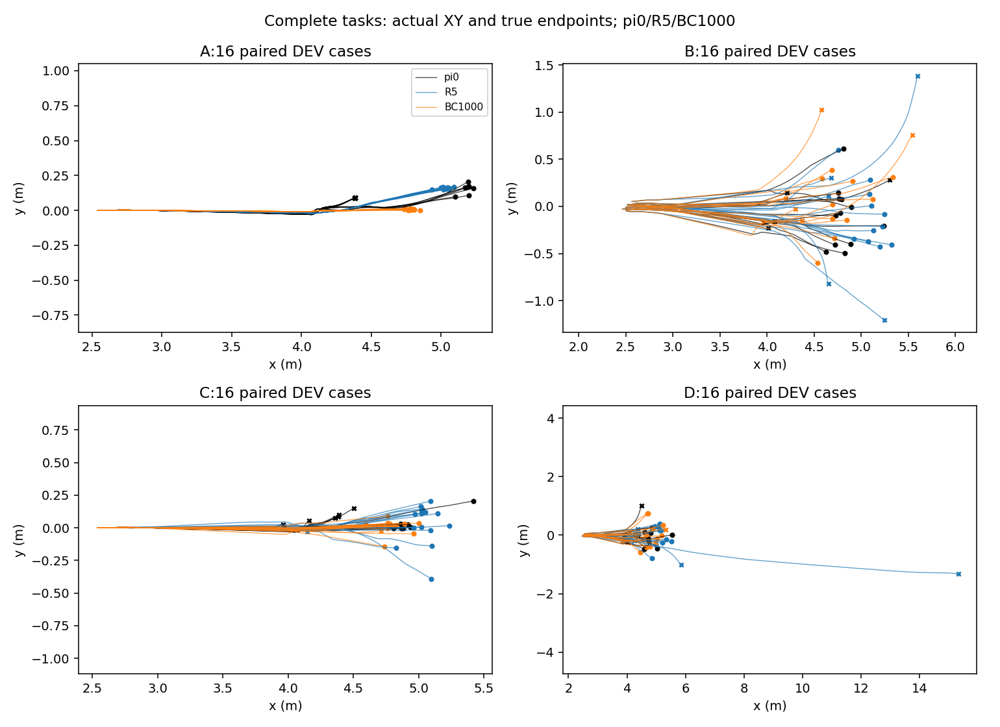
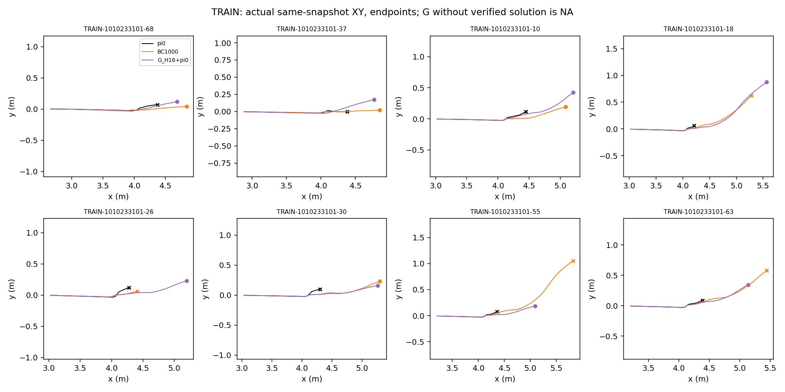
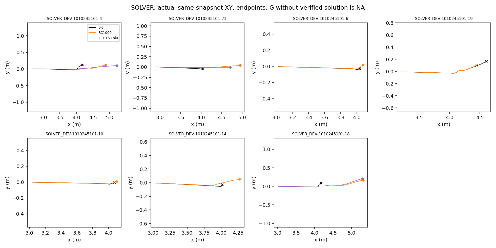

# D2 B-only：已吸收部分教案，仍存在保留性缺口

黑色为冻结π0，蓝色为冻结R5，橙色为BC1000，紫色为固定G前16步＋π0尾部。圆点为原成功标准达成，叉号为未达成功的实际终点（含窗口用尽）；轨迹变宽和走得更远不代表成功。四格64题全部包含，详细逐题图及原始坐标在服务器report_001。

审阅基准 `0b938ae`，正式执行代码 `9955b8e`。只训练B，源是原始π0，Actor可训练，整个Actor/privileged normalizer与critic冻结。Adam1e-5、demo1、keep1、batch256、Actor clip1；一次连续2000监督更新，不是恢复PPO微验状态，也没有BC resume实现。五个完整节点的Adam计数、RNG、绝对监督步、Actor/critic/normalizer读取校验通过。45项相关CPU行为测试通过；能力结果来自以下实际GPU轨迹。

全部8条G教案525观测—动作，按祖先均衡、前缀/π0尾部各半；keep为26条成功轨迹1951观测，名义/随机各半。14条名义是同物理起始条件的数值副本，12条随机是不同初态。DEV及其祖先不进入梯度、normalizer、E图或G成功池。E73/G73来源冻结，无新搜索或更新。

|策略/更新|TRAIN独立 /8|SOLVER_DEV独立 /7|A /16|B /16|C /16|D /16|旧成功丢失|新增成功|
|---|---|---|---|---|---|---|---|---|
|π0 / BC0|0|0|7|12|8|11|0|0|
|R5|本轮重点3根复核|原参照不冒充新7根全测|16|11|15|10|单列对照|单列对照|
|BC100|5|1|16|13|12|10|7|20|
|BC500|3|1|16|13|14|11|5|21|
|BC1000|4|3|16|10|15|10|7|20|
|BC2000|5|3|16|12|12|11|4|17|

A为同名义初态数值重复；B/D共初态，C/D共请求，不能当64个独立样本。新DEV与旧V保持分开：这组R5在B/D各比π0少1题，不覆盖原V较大面板的结果。

**选择BC1000**：主指标为全部7根SOLVER_DEV独立成功数，1000与2000同为3/7，选最早；不按TRAIN吸收、奖励或MSE改选。learner_last=BC2000，B阶段候选=BC1000，全局best_dev_candidate仍为冻结R5，published_policy=null。

选定候选的8根TRAIN首次4成功，两次固定重放仍有4个稳定成功、3个稳定失败、1个歧义（root55：0/1/0）。曾在BC100得到5/8，不能把最高TRAIN吸收率冒充最终选模结果。未见root迁移为3/7，仅来自三个已有合格G解的DEV根；其余4根G参考为NA，学生仍全部评价，不把NA填成老师失败0。DEV是参与选模的小样本开发证据，不是TEST或可靠泛化率。完整逐根标签见[转化矩阵](conversion_matrix.json)。D0新增87和完整任务新增20都不是老师转化计数。

BC1000首次完整任务相对π0新增20、丢失7；有限配对重放新增13、丢失3，其中B_06/C_10两题两次均丢失。100与1000节点按预声明警戒各做一次源/候选完整64题重放，未确认同格超过5pp的净下降，未反复测到通过。源自身与学生均出现数值标签变化：即使开发警戒未确认，仍不能称无遗忘。[逐格增失和数值翻转](paired_retention.json)。

|预选TRAIN root后缀|老师16＋π0|学生16＋π0|老师16＋学生|学生全程首次|
|---|---|---|---|---|
|68|1|1|1|1|
|10|1|1|1|1|
|55|1|1|1|0（复核歧义）|
|63|1|0|1|0|

H16不reset。roots10/55/63前16步动作、观测、qpos/qvel精确匹配，root68存在交接前物理状态先偏，不能仅归因于后缀。[前缀一致性](H16_prefix_equivalence.json)。root55首个有效接触在原episode43，禁止接触失败在106；root63接触42、侧倾失败88。桥只执行episode18–33，不能因失败在着陆后就把桥移到着陆后。root55是条件性的自身状态后缀失效线索，root63支持前缀/闭环状态偏移诊断；不把单次模式当稳定因果证明。[原始轨迹阶段与最早差异](trajectory_diagnostics.json)。

R5原一次失败的3根同流复核：root10两次成功，root55/63两次失败。BC1000在root10成功因此不能称超过R5；root55歧义、root63仍失败。未证明新增了R5稳定不会的能力。所有8根均参与BC，没有只训练这3根。

实际同批Actor梯度记录demo/keep加权范数、余弦、总梯度、clip因子和Adam参数增量；固定TRAIN探针另存。100更新余弦−0.66、1000更新−0.61，监督误差下降没有保证闭环成功：root63前缀离线MSE从100的0.00548降至1000的0.00107，却从成功变失败。PPO微验的critic共同裁剪问题仅记录，本B未改PPO优化器、奖励、网络或物理，也未把keep乘600。

**下一步决策**：G8蒸馏通路部分有效、未见root迁移有开发信号，但没有完成无遗忘修复。优先定位未吸收根的前缀及学生自身访问状态后缀问题，再为独立新TRAIN扩充保持覆盖；不能拿本DEV失败回流训练。保留π0/R5，暂不直接开始A/C或扩大扰动。若以后进入PPO，四池GPU验收和实际共同裁剪审计另作有界前置，原PPO预算不自动启动。没有证明G优于Noise或扩散必要。

B_001在0更新物理评价后因固定探针错误导入失败，61910收费保留，0监督更新；修复后B_002通过显式previous-zero凭证复用同输入基线/零标签，fresh π0/Adam一次连续训练，没有假resume或重复基线。B_002实际313226收费，其中active125803、padding187423，原D2工程12900加失败61910，D2累计388036/2000000；B_002实际2125.2s，原12h时钟未重置。监督更新2000单列，不与物理收费相加。其余预算未花满。R74/V/D0/D1未续跑；PPO/E/G新更新0，TEST未打开。

[机器摘要、身份和实际Actor更新](summary.json)、[完整BC状态校验](BC_full_state_verification.json)。服务器原始运行 `/home/qy/DVGC/JIT/runs/experiments/retention_next_20261010/B_002`；完整源码与输入锁在那里保存。当前运行[TensorBoard](http://localhost:6027)已通过HTTP读取实际DEV奖励0/100/500/1000/2000，非伪造训练奖励；BC没有采样训练奖励。桌面整体完成通知已交付且无通知错误。
