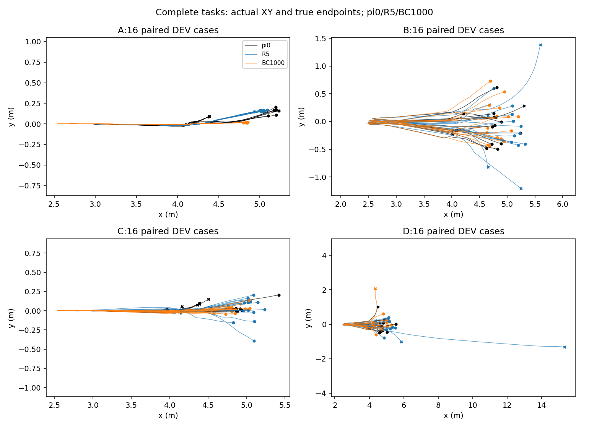

# B_keep_coverage：单次覆盖试点的完成结果

只检验旧技能TRAIN保持数据覆盖；不是完整遗忘方案，不预设容量足够或不足。用户“继续／你继续就好”授权本次已审阅有限执行。运行 `B_keep_coverage_003`，执行HEAD `cb1e139df2661c18580056d48fadb0ccdf89d338`，Python执行锁仍对应 `0ebfd3c`。原始π0/fresh Adam/RNG；normalizer/critic冻结；Actor-only Adam1e-5/demo1/keep1/batch256/clip1；原G8教案525帧、观测、网络、动作、物理、奖励、H16和成功标准全部不变。无PPO/E/G更新，无DEV回流。demo+keep本来就是双来源监督，不加重复蒸馏项。

80回合keep仅收真实成功61条（名义6/16、随机55/64）；19个物理失败排除且收费，没有补seed。旧26条1951帧全部保留；合并87条6289帧，接触帧及之后2636帧。名义只有1个物理条件的重复。名义/随机组各50%采样质量，祖先/轨迹均衡。真实worker加载新merged keep，路径和hash见[worker_inputs](worker_inputs.json)。

|节点|TRAIN吸收/8|SOLVER_DEV/7|A/16|B/16|C/16|D/16|完整DEV新增|丢失|净差|
|---|---:|---:|---:|---:|---:|---:|---:|---:|---:|
|0|0|0|7|12|8|11|0|0|0|
|100|3|1|16|12|13|10|21|8|13|
|500|3|2|16|13|15|10|20|4|16|
|1000|5|3|16|14|15|10|22|5|17|
|2000|5|2|16|15|12|12|21|4|17|

选1000（全7根主分数，平局选早，固定B/D警戒复核规则未改）；learner_last=2000，stage_candidate=BC1000，冻结全局候选仍R5，published_policy=null。R5自身Actor+normalizer完整DEV基线复用16/11/15/10，不自动发布学生。

8条TRAIN老师均有合格G解；所选学生首次学会5/8，固定三次仅4根稳定成功：68/37/10/26；18/30/55稳定失败；63=[1,1,0]歧义。原B稳定成功30本次稳定失败，原B失败26本次稳定成功，稳定吸收总数仍4/8。root30是历史学生学会的新技能损失，和π0旧能力损失分开。全7根SOLVER_DEV成功3/7（4/21/18），均为有G参考的3根；其余4根G参考NA、学生均失败。它是已用于选模的小样本DEV迁移，不是最终TEST。四格新增22不是老师转化结果。

完整DEV首次旧损失原B7→本次5，固定重复原B3→本次4；未证明可靠保留性改善。当前重复新增17、丢失4、净差13；两次配对均失去B_04/C_10/D_03/D_09。B_06旧损失消失，C_10保留。源标签翻转A/B/C/D=7/1/2/0，学生=0/1/0/1；D_07首次失败、重复成功。16题每格一题=6.25pp。数值重复不是独立训练seed，不把首次改善写成稳健效果。

[闭环诊断](diagnostics.json)：这4道重复损失题首次物理侧倾越界都在有效接触后；root30接触42、侧倾失败57控制帧。子步首次事件未知，不能只看终止码，也不能因此把恢复H16后移。2000次实际同mini-batch梯度余弦为负91.7%、均值−0.402，clip均为1；Adam参数增量全部保存。梯度冲突是描述性证据，不等于已证明权衡或容量问题；MSE下降不等于闭环学会。

下一试验只建议 **B：TRAIN学生自身访问状态上的闭环指导诊断**，不自动执行，不自动补同类keep。先冻结当前学生，仅8个原TRAIN根，在原H16内j=[4,8,12]预声明查询；固定π0尾部，G16+source同17世界，固定赢家2次重放，执行长度H16-j且原交接时间不变。未达采样点记缺失，不换点补成功。π0能救/老师能救/学生根是否成功分别记，禁止平均旧老师与恢复老师动作。

独立拟定上限：访问状态采集8×17×400=54400；24查询×3批（搜索+2固定重放）×17×400=489600；总 **544000 charged、3小时、0 BC/PPO/E/G更新**。本次D2累计776098，若另获授权完成该诊断最多1320098/2000000；这不是剩余预算执行许可。未来时钟必须另行冻结和授权，不重置本次原时钟。当前仅设计，尚无可执行输入锁/剩余窗口接口验证。详见[下一试验提案](next_experiment_proposal.json)。

若G在自身访问状态可验证救回、学生仍失败，支持可行动的闭环分布偏移；π0独自可救说明旧参考指导可用；都未找到解只说明该有限oracle无见证，不能推断物理无解或容量不足。获得可靠指导也不等于学生已吸收；新BC需另外批准。A的权重对照暂缓，因为冲突梯度并非因果证据；C的容量对照仅准备设计，因为本次既换了哪些根吸收也保留重复旧损失，未建立容量瓶颈。宽Actor声明/零更新迁移/独立老师与Adam边界见[设计报告](../../../plans/retention_next_20261010.md)，未实现或验证。

本次实际新增388062 charged（active136500、padding251562），此前388036，D2累计 **776098/2000000**；2000监督更新单列。执行用时2297.8秒，原截止2026-10-11 04:53:04.693638+08:00未重置，完成于该截止前。0/100/500/1000/2000真实序列化Actor/Adam计数与矩、RNG/绝对时钟、normalizer/critic、推理配对均[审计通过](BC_full_state_verification.json)；保存完整状态不冒充已实现resume。TB6028实际本轮奖励及BC标量加载；桌面完成通知送达、无delivery_errors。

首次report因缺独立BC状态审计文件失败，保留coverage_report_0002；以[CPU saved-state审计脚本](verify_saved.py)核验后补齐真实证据，再生成完整coverage_report_0003；0仿真/0更新，未改训练源代码或锁。不是额外训练重试。

[同根老师—学生矩阵](conversion_matrix.json)、[TRAIN三次标签](TRAIN_repeat_labels.json)、[逐节点物理阶段](trajectory_diagnostics.json)、[配对保持与翻转](paired_retention.json)、[全部输入/节点/费用](summary.json)、[TRAIN实际XY](xy_train_roots.png)、[全7 DEV实际XY](xy_solver_roots.png)。无预设XY路径；所有端点取真实失败/成功终点。保留π0/R5，本阶段停止；未证明可靠恢复能力提升，不自动开PPO或200轮。

准备阶段历史说明、测试和静态审计见[原准备交付](preparation_description.md)，它的prepared/未授权状态只描述当时，不能冒充当前。运行原始权重/物理NPZ在服务器，不入Git。
