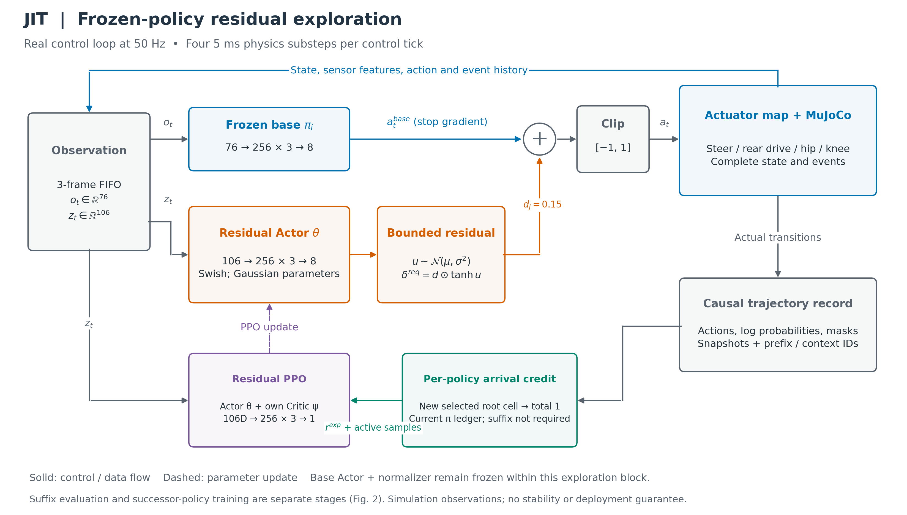
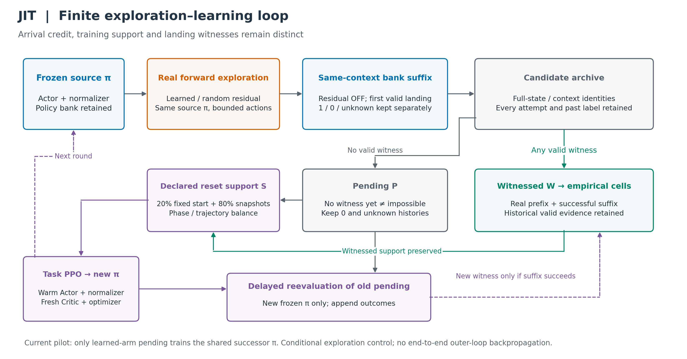
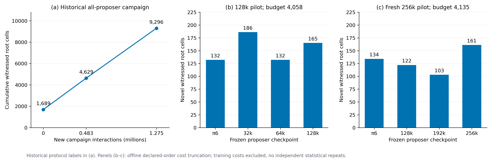
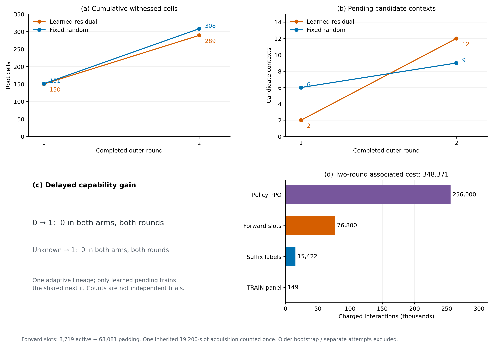
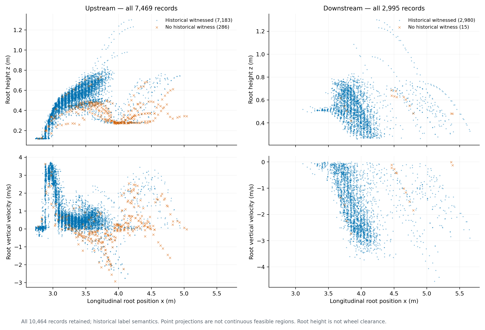

# JIT：基于残差探索与延迟策略验证的自行车摆机器人经验跳跃包线构建

**JIT: Empirical Jumping Envelope Discovery through Residual Exploration and Delayed Policy Validation**

中文详细工作稿 · 2026-09-12 · 数据角色：TRAIN / development

> 本稿以已执行的 DVGC/JIT 代码和工件为依据。方法实现、历史实验结果和待验证假设分别说明。作者、单位及投稿信息尚未填写；这是一份可继续完善的研究草稿，不是已完成全部主实验的投稿终稿。当前最关键的负结果是：两轮延迟学习中，旧无见证候选转为成功见证的数量均为零。

## 摘要

成功完成一次跳跃只能展示一种控制行为，不能描述机器人在该行为周围还有哪些状态能够到达并完成落地。本文研究固定自行车摆机器人、固定近地起点和首次有效落地终点下的经验跳跃包线发现。JIT 首先利用分阶段训练支持获得统一跳跃种子策略，再以冻结策略和有界动作扰动采集真实到达状态，通过同一完整状态及控制上下文的成功续接见证构建经验支持。为避免将当前策略能力误当作物理可行性上限，进一步引入逐策略到达新颖性奖励、独立残差探索网络以及待学习候选池：新候选即使没有当前策略库的成功见证，仍可按预声明配额参与后继策略训练，并在新策略冻结后进行延迟评价。

在历史两轮固定扰动、多策略生产实验中，声明网格下的累计 root cells 从 1,689 增至 4,629 和 9,296，新增交互为 1,275,465。随后完成的残差/随机条件探索 pilot 包含两次各 128,000 步后继策略训练，关联实际计费交互为 348,371；最终学习残差与随机臂分别保留 289 和 308 个已见证 root cells，旧无见证候选新增成功见证均为 0。这些结果验证了可审计的探索—训练—延迟评价执行链，但尚未证明学习残差的效率优势或延迟候选学习收益。当前研究输出是有限采样下的经验见证集合，不是连续可达域认证、全空间收敛结论或单一策略掌握整个跳跃包线的证明。

**关键词：** 机器人跳跃；残差强化学习；经验能力包线；策略互补；延迟评价；可复现仿真

## 1. 引言

### 1.1 从成功行为到能力支持

自行车摆系统在运动中需要协调转向、后轮驱动和髋膝机构，跳跃过程还伴随地面接触、腾空及落地事件切换。一个能够从固定起点成功落地的策略提供了有价值的行为种子，但沿该策略轨迹观察到的状态只是任务空间中的有限样本。对机器人能力的进一步理解，需要回答：偏离当前轨迹以后，哪些状态仍然可以由真实动力学到达，并继续完成声明的落地任务？探索这些状态要付出多少成本？

本文将这一问题表述为经验跳跃包线发现。这里“包线扩张”指已发现并保存的经验支持增加，机器人固定物理系统的能力并不会因地图更新而改变。我们不要求一个新策略覆盖所有旧状态；不同前向策略、残差扰动和续接策略可以提供互补见证。每条见证仍必须能追溯到同一个候选状态和控制上下文。

### 1.2 当前策略失败不能替代物理判断

仅按当前策略的续接成功筛选探索状态，可能形成自我限制：某个真实到达状态暂时超出当前控制器能力，但后继策略通过训练可能学会从它落地。把这类状态立即删除，会同时删除学习机会。另一方面，直接把所有到达状态都纳入成功包线又会夸大能力。

JIT 因此区分“探索信用”“训练支持”和“成功见证”。新颖性奖励可由真实到达产生；未获见证的状态进入 pending；训练可以使用其中的声明子集；只有实际成功续接才使它进入已见证包线。延迟评价允许以更强或不同的策略重新检查过去的候选，但并不预设未来必然能成功。

### 1.3 研究目标、贡献与当前证据等级

本文围绕三个可检验问题组织：

1. 多个互补冻结策略能否在可追踪成本下积累更广的真实到达与落地见证？
2. 在同一个冻结跳跃策略上，学习残差能否比随机残差更有效地发现新的、最终有用的候选？
3. 保留当前无见证候选并用于后继策略学习，能否产生旧候选的新成功续接？

目前可据实贡献的是一套固定任务契约下的经验见证构建流程、逐策略残差探索与延迟评价的实现，以及包含正面历史结果和当前负结果的完整开发证据。问题2和问题3仍是未被现有实验支持的研究假设。若主实验不能建立这两项收益，投稿叙事应收缩为经验能力发现与证据方法，不应以算法名称替代效果。

## 2. 相关工作与定位

**自行车动态技能。** Bicycle Acrobatics 使用强化学习及行为组织实现多种自行车机器人特技；LineRides 利用空间引导线和稀疏关键姿态学习可指令特技。它们说明自行车跳跃和技能组合已有相关研究，因此本文不声称“首次实现自行车跳跃”。JIT 的 centerline 来自已保存的真实成功轨迹，用于组织候选与几何分析，并非要求策略跟踪的人为目标线。[Fahmi et al., 2026](https://arxiv.org/abs/2608.00880)；[Rho et al., 2026](https://arxiv.org/abs/2605.05110)。

**残差控制与策略优化。** Residual Reinforcement Learning 将已有控制与学习残差相加，提供了利用基础控制知识的通用形式。JIT 采用类似的动作组合，但当前探索器的目标是相对冻结策略的到达新颖性，基础跳跃策略的任务目标仍是完成跳跃。PPO 用于优化这两类策略，并不是本文单独的创新主张。[Johannink et al., 2018](https://arxiv.org/abs/1812.03201)；[Schulman et al., 2017](https://arxiv.org/abs/1707.06347)。

**探索档案与重置课程。** Go-Explore 强调保存有价值的状态并返回后继续探索；MAP-Elites 用描述单元组织多样化解；Reverse Curriculum 从较容易的初始状态逐渐扩大训练范围。JIT 与这些思想有联系，但当前实现既不是完整 Go-Explore，也不是质量多样性优化的等价重命名。关键区别需要落在真实前缀、同上下文后缀、候选与见证分离及未来策略重评的具体协议，并通过消融证明其作用。[Ecoffet et al., 2021](https://arxiv.org/abs/2004.12919)；[Mouret and Clune, 2015](https://arxiv.org/abs/1504.04909)；[Florensa et al., 2017](https://arxiv.org/abs/1707.05300)。

**与形式化可达性的区别。** Hamilton–Jacobi 可达性研究在声明动力学和不确定性下计算具有明确数学语义的集合。本文保存的是有限策略、有限样本下的成功路径见证，不提供区域中每一点的控制保证，也不估计最坏扰动下的安全性。使用“经验包线”必须保留这一证据边界。[Bansal et al., 2017](https://arxiv.org/abs/1709.07523)。

## 3. 问题定义

### 3.1 完整状态、观测与离散控制系统

以完整仿真及控制上下文表示候选状态：

$$
\chi_t=(q_t,\dot q_t,c_t,h_t,a_{t-1},e_t,p_t,\xi_t,\tau_t). \tag{1}
$$

其中，q与其速度为物理状态；c为保存的执行器目标ctrl；h为真实观测FIFO及有效计数；e为起跳、apex、接触等事件历史；p为运动phase；ξ为随机状态；τ为声明的时钟/计数语义。候选还绑定配置、来源轨迹、动作前缀和控制器身份。式(1)是协议状态的抽象表示，不宣称它等同于MuJoCo所有内部缓存的逐位转储。

每20 ms执行一个归一化四维动作，在四个5 ms物理子步中保持当前执行器目标：

$$
\chi_{t+1}=\Phi_{0.020}\bigl(\chi_t,\operatorname{Map}(a_t)\bigr),\qquad a_t\in[-1,1]^4. \tag{2}
$$

固定模型为 `orange_bike_4kg_horizontal.xml`，声明载荷2kg；完整起点纵向位置2.5m、初始轮胎间隙约3.1cm。该起点是用户接受的近地初始化，不能称作轮胎严格静态贴地平衡点。本文范围到首次有效落地，不把落地后长期稳定恢复纳入当前成功定义。

### 3.2 同上下文的成功见证

设冻结策略库为下式，其中每个成员包含Actor、normalizer、配置和payload身份：

$$
\mathcal B_k=\{\pi_0,\ldots,\pi_{m_k}\}. \tag{3}
$$

候选χ必须首先属于真实前向到达集合A。续接标签定义为：

$$
Y_{\mathcal B_k}(\chi)=
\begin{cases}
1,&\exists\pi_j\in\mathcal B_k:\text{无冲突首次有效落地见证},\\
0,&\text{所有声明评价者完成且均未成功},\\
\bot,&\text{未评价、未完成、错误或冲突}.
\end{cases} \tag{4}
$$

这里0只描述当前bank与当前协议下未找到见证。仿真在声明任务时限或horizon内完整执行但未落地，是该评价者的完成失败；仅全部声明评价者均完成失败时bank标签为0。进程超时、工程错误、未评价和未完成保持unknown；同一终点同时出现落地和物理失败则保持unknown。首次落地需要此前满足两轮离地条件，之后合格轮接触、穿透限制、无body contact且数值有限；当前没有额外25步落地恢复或0.05m向前运动条件。

当前 `fresh_continuation_v1` 保留物理与控制历史，但按声明重置episode/phase行政时钟、累计return和部分事件计时。因而本文主张的是这一明确时间变换下的续接见证，不是未经检验的全任务剩余时长拼接等价。历史数值replay差异已被用户接受并保留；不增加未请求的严格replay门槛，也不声称其逐位一致。

### 3.3 候选、支持与经验包线

用W表示已有见证，P表示尚无见证的pending，S表示训练支持：

$$
\mathcal W_k=\{\chi\in\mathcal A_k:Y_{\mathcal B_k}(\chi)=1\},\qquad
\mathcal P_k=\mathcal A_k\setminus\mathcal W_k. \tag{5}
$$

S可以包括W和按预声明配额选择的P。P中需另外记录最近的no-witness或unknown状态，不能用一个“负样本”字段合并它们。

给定物理投影Q，经验网格包线为：

$$
\widehat{\mathcal E}_k=\{Q(\chi):\chi\in\mathcal W_k\}. \tag{6}
$$

先在准确状态及完整上下文上成立前缀/后缀见证，再投影为单元；不允许用一个状态的到达和同格另一个状态的落地拼接证明。同一见证可使用不同前向策略和续接策略，所以式(6)不是任何单个Actor的实现域。

### 3.4 固定网格与纵向展示

当前奖励使用 `root_geometry_v1`，物理投影包含：

$$
y(\chi)=(x,y,z,v_x,v_y,v_z,\phi,\theta,\psi,\omega_x,\omega_y,\omega_z). \tag{7}
$$

位置分辨率0.1m，线速度0.1m/s，角度0.5°，角速度2°/s；phase另作离散键。每维对称四舍五入：

$$
Q_j(y_j)=\operatorname{sgn}(y_j)\left\lfloor\frac{|y_j|}{\Delta_j}+\frac12\right\rfloor. \tag{8}
$$

5cm间隔只用于纵向候选/绘图组织，与式(8)的12维单元不同。一个高维cell只保证其中保存了某个见证点，不保证整个cell连续可行。细量化下cell很多也不一定代表宏观几何区域很大。

## 4. 方法

### 4.1 分阶段支持引导与种子策略

JIT的初始化历史包括上升/下降策略、阶段快照与加权Tube0，随后训练完整跳跃策略。初始Tube0有222条带权训练行，其中42条为历史负标签，因此它是训练支持而非纯成功包线。当前命名π0实际引用后续Round1冻结工件，不能把最早统一checkpoint与它混用。历史π3的混合终点gate无效，但不排除该冻结策略在新协议中提供新的有效见证。

初始化的作用是提供可执行种子和可访问训练状态。本文尚未提供完整计费的“从零完整任务训练”匹配消融，因此不声称这一bootstrap一定更省样本。centerline由实际π0轨迹帧构成，用于相位和纵向坐标组织，不插值得到新的可达状态。

### 4.2 冻结跳跃策略上的有界残差探索

基础Actor读取76D观测，残差Actor读取106D特权观测。其76D与106D归一化为同一冻结normalizer工件的两个统计分支，冻结基础动作为：

$$
a_t^{\rm base}=\tanh\mu_{\pi_i}(N_i^{76}(o_t)),\qquad\nabla_\theta a_t^{\rm base}=0. \tag{9}
$$

残差网络每层为Swish，三个隐藏层各256维，输出8个分布参数：

$$
h^{(0)}=N_i^{106}(z_t),\quad h^{(l+1)}=\operatorname{Swish}(W_lh^{(l)}+b_l),\quad l=0,1,2. \tag{10}
$$

$$
[\mu_\theta,s_\theta]=W_3h^{(3)}+b_3\in\mathbb R^8,\qquad
\sigma_\theta=\operatorname{softplus}(s_\theta)+0.001. \tag{11}
$$

$$
u_t=\mu_\theta+\sigma_\theta\odot\epsilon_t,\quad\epsilon_t\sim\mathcal N(0,I_4),\qquad
\delta_t^{\rm req}=d\odot\tanh u_t. \tag{12}
$$

$$
a_t=\operatorname{clip}(a_t^{\rm base}+\delta_t^{\rm req},-1,1),\qquad
\delta_t^{\rm eff}=a_t-a_t^{\rm base}. \tag{13}
$$

当前d各分量均为0.15。请求残差与最终有效残差都保存，因为基础动作接近边界时clip会减少实际扰动。幅度界位于归一化动作坐标，不是物理力矩界，更不是稳定性保证。随机对照逐步采样相同幅度的四维均匀残差，保留同一基础π。

每个外轮初始化新的残差Actor、独立残差Critic和Adam，在本轮batch内延续更新；没有一个跨所有policy ID共享的通用条件探索器。当前输入未额外拼接基础动作、policy ID或goal。均值头零初始化，因此初始确定性残差为0，初始随机残差仍有方差。所谓“初始确定性落地”只是零均值残差诊断时基础π的行为，不是预先向网络灌入落地目标。



**图1.** 实线为动作/观测与轨迹数据流，虚线为训练更新。基础策略与其normalizer在探索块内冻结；残差Actor和独立残差Critic更新。续接评价属于外循环，使用冻结库成员而不叠加探索残差。图中的观测来自仿真，不作实车可观测性保证。

### 4.3 输入、输出与规模

单帧f包含25项：机体系重力方向3、角速度3、加速度3、转向/髋/膝角3及角速度3、前后轮速2、上一四维动作4、前向速度1、障碍相对位置1、root高度1、有效位1。基础观测为：

$$
o_t=[f_{t-2},f_{t-1},f_t,\operatorname{jump\_signal}]\in\mathbb R^{76}. \tag{14}
$$

它是三帧FIFO而非LSTM，最老与最新真实帧跨40ms。特权输入为：

$$
z_t=[o_t,qpos^{12},qvel^{11},roll,pitch,yaw,v_x,v_y,v_z,\operatorname{illegal\_contact}]
\in\mathbb R^{106}. \tag{15}
$$

| 模块 | 结构 | 参数数 | 更新方式 |
| --- | --- | ---: | --- |
| 基础跳跃Actor | 76→256→256→256→8 | 153,352 | 探索期间冻结；后继策略任务PPO时训练 |
| 残差Actor | 106→256→256→256→8 | 161,032 | 本轮探索PPO |
| 残差Critic | 106→256→256→256→1 | 159,233 | 独立探索价值拟合 |
| 新增残差Actor+Critic | 上述两者 | 320,265 | 不含归一化统计与优化器槽 |

8维头表示4个均值与4个尺度，实际动作为4维。网络隐藏层均为Swish，无LayerNorm。输入中的前向速度/root高度/障碍相对位置当前来自仿真；即使字段叫estimated velocity，也不能直接视为已验证实车估计量。

归一化动作依次映射转向位置、后轮速度、髋位置、膝位置。本轮采用keyframe-centered absolute：

$$
q_{\rm steer}^{*}=0.8a_1,\qquad
\dot q_{\rm rear}^{*}=\operatorname{clip}(12+12a_2,-5,40). \tag{16}
$$

$$
q_j^*=\begin{cases}
q_j^0+a_j(q_j^{\max}-q_j^0),&a_j\ge0,\\
q_j^0+a_j(q_j^0-q_j^{\min}),&a_j<0,
\end{cases}\quad j\in\{\mathrm{hip},\mathrm{knee}\}. \tag{17}
$$

髋位置界[-1.3,0.5]rad，膝[-1.5,2.5]rad，参考角从XML keyframe读取。后轮XML界虽为[-5,40]，当前a∈[-1,1]时式(16)实际给出[0,24]rad/s目标。源码也支持旧incremental knee分支，但本轮不使用；不得与其他项目转向角速度接口混淆。

### 4.4 针对当前π的新到达奖励

每个冻结source π的探索块维护到达ledger。初始ledger绑定该π声明基线和未扰动到达；随后累加本探索器已奖励单元，不取所有历史策略的全空间并集。

设batch b中选择的真实候选为c，所属cell为Q(c)，对应的实际动作tick与episode为(t_c,e_c)。只有通过prefix/context等资格检查的候选可参与奖励。对当前ledger之外的同一新cell q，定义本batch出现次数：

$$
n_b(q)=\sum_{c\in\mathcal C_b}\mathbf1[Q(c)=q]\,\mathbf1[q\notin\mathcal L_{i,b}]\,\mathbf1[\operatorname{eligible}(c)]. \tag{18}
$$

探索奖励为：

$$
r^{\rm exp}_{t,e}=\sum_{c:(t_c,e_c)=(t,e)}
\frac{\mathbf1[Q(c)\notin\mathcal L_{i,b}]\,\mathbf1[\operatorname{eligible}(c)]}{\max(1,n_b(Q(c)))}. \tag{19}
$$

$$
\mathcal L_{i,b+1}=\mathcal L_{i,b}\cup\{Q(c):c\in\mathcal C_b,\operatorname{eligible}(c)\}. \tag{20}
$$

这使每个新cell在一个batch中总信用为1，而不是多次访问重复得分。当前arrival模式不要求suffix成功，不因父轨迹后来失败就删除先前到达事实。当前也不叠加基础任务回报、失败惩罚、姿态惩罚或基础Critic质量罚项。

候选由实际帧选择：x范围[2.75,8]m，每episode最多4个；先按phase及5cm纵向bin选首个合格帧，再在可用phase之间分配有限名额，在各phase序列上均匀选索引。候选上限限制了式(19)最多能看见多少区域。当前每批8个环境，因此32个新cell即可能使信用触及采样上限；该现象必须与“探索真的更有效”区分。

### 4.5 残差PPO与任务PPO分开

探索器保存tanh前采样u及其分布logprob。概率密度含tanh变换的Jacobian：

$$
\ell_\theta(u_t,z_t)=\sum_{j=1}^{4}\left[\log\mathcal N(u_{tj};\mu_{\theta j},\sigma_{\theta j}^2)-\log(1-\tanh^2u_{tj})\right]. \tag{21}
$$

令ρ为新旧残差策略的概率比，采用标准PPO截断代理目标：

$$
\rho_t=\exp(\ell_\theta-\ell_{\theta_{\rm old}}),\qquad
L_{\rm actor}=-\mathbb E_m\left[\min(\rho_t\bar A_t,\operatorname{clip}(\rho_t,1-\epsilon,1+\epsilon)\bar A_t)\right]. \tag{22}
$$

m是有效步掩码；padding不贡献梯度。当前GAE仅在active步计算：

$$
D_t=r_t+\gamma m_{t+1}V_{\psi_{\rm old}}(z_{t+1})-V_{\psi_{\rm old}}(z_t),\qquad
A_t=m_t[D_t+\gamma\lambda m_{t+1}A_{t+1}]. \tag{23}
$$

$$
L_{\rm value}=\tfrac12\mathbb E_m[(V_\psi(z_t)-(A_t+V_{\psi_{\rm old}}(z_t)))^2],\quad
L=L_{\rm actor}+c_VL_{\rm value}-c_H\mathcal H. \tag{24}
$$

有效优势标准化；最后一步next value为0，没有另外的time-limit bootstrap分支。当前PPO没有目标KL早停，也没有全外循环收敛判据。概率比对应残差随机变量；最终动作加和clip是多对一变换，本文不声称式(21)是最终执行器动作密度。

新跳跃π的训练则沿用原phase task reward。其形式可概括为上升与下降reward函数按phase选择，但必须保留异常累计回报处理：

$$
r_t^{\rm task}=\begin{cases}
R_U(\chi_t,a_t,\chi_{t+1}),&p_t=U,\\
R_D(\chi_t,a_t,\chi_{t+1}),&p_t=D.
\end{cases} \tag{25}
$$

其中R_U/R_D由冻结配置与 `unified_env.py` 调用的阶段reward实现定义，不另行杜撰为简单高度奖励。上升stuck/yaw失败时，当步被设为`failed_episode_return - episode_return`，令该回合累计return为-100。下降适配器在首次有效落地终止，旧reward实现虽保留恢复项，不能由此推断本轮验证了落地后恢复。本稿的探索目标是式(19)，不是式(25)。当前task reward系数、例外和函数出处见附录B及对应锁定配置。

### 4.6 pending重置支持与后继策略学习

每轮将尚未见证但有真实到达来源的候选保留为P。后继π从上一Actor与normalizer warm start，Critic及optimizer重新初始化；它不会简单覆盖旧库中的历史策略。以p∈{up,down}记phase，重置分布为：

$$
P_{\rm reset}=0.2P_{\rm fixed}+
0.8\sum_p\tfrac12[(1-\beta_p)P_{W,p}+\beta_pP_{P,p}]. \tag{26}
$$

其中P_fixed固定物理初态和初始控制历史，随机键按声明reset协议赋值。若phase p存在pending，则β_p=0.25，否则为0。pending按轨迹均衡，witnessed支持保留既有phase/group质量。若两phase均有pending，总体质量为20%固定起点、60%witnessed、20%pending；**本pilot的pending训练支持仅upstream，声明总体pending质量约10%**。这也说明“25%pending”只指某phase内部快照质量，不能泛化为所有reset。

从pending状态训练为学习提供机会，但reset本身没有创造从任务起点到该状态的前向证据。只有已保存的真实prefix提供该证据。当前只有learned臂的pending驱动共享后继π，随机臂随后也使用这一新π；这是有意限定的条件探索pilot，不能冒充随机策略独立训练的全流程基线。

### 4.7 延迟评价与外循环

冻结新π后，在旧pending上追加其续接结果。新结果1可产生旧无见证→见证转化；0/unknown仍保持pending。延迟收益定义为：

$$
G_k^{\rm delayed}=\left|\{\chi\in\mathcal P_k:
Y_{\mathcal B_k}(\chi)=0,\ Y_{\mathcal B_{k+1}}(\chi)=1\}\right|. \tag{27}
$$

unknown→1单独计数，不能把未测候选首次评价成功称为“旧策略失败被新策略学会”。pool保存所有历次标签与bank身份，新见证可用于后续支持选择。探索器下一轮以新π为source，重新建立自己的基线与残差训练块。

该反馈是算法外循环的状态和数据更新，不是对整个长仿真链进行自动微分，也不把旧PPO轨迹修改奖励后直接复用。未来若希望对“最终可学习性”进行信用分配，应另行设计、验证并计费；当前尚未实现这种跨轮探索价值学习。



**图2.** 蓝色为冻结跳跃策略，橙色为真实探索，灰色为尚无见证候选，绿色为成功见证，紫色为后继策略训练及延迟重评。实线表示实际数据流，虚线表示下一轮/重新评价；不存在从最终包线向整个外循环反向传播的梯度。随机臂共用后继π的限制在图中标注。

### 4.8 算法与停止

```text
输入：固定起点及任务契约、冻结策略库B、witnessed支持W、总预算Cmax、轮数K
对 k = 0, …, K−1：
    绑定冻结source πk；初始化本轮残差Actor、Critic、per-π到达ledger
    在声明预算内用真实动力学采样，按新到达cell信用训练残差Actor
    保存完整prefix/context；对候选按当前B进行可短路的成功见证评价
    已见证候选加入W；其余保留pending，并记录no-witness/unknown
    按预声明phase/group配额将pending加入独立训练支持S
    用任务PPO训练后继π，warm Actor+normalizer、fresh Critic+optimizer
    冻结新π并加入B；对旧pending追加新π续接，更新见证和下一轮支持
    输出全部轨迹、标签、图、数据、身份、实际与预留成本
    若达到轮数/预算，或发生数值/来源错误，或无声明可训练pending，则停止
输出：准确见证记录W、物理去重集合E、未见证候选P、完整成本与来源
```

训练上限和轮数只定义有限工作量。若在相同协议、网格和来源身份下保留历史有效见证，则：

$$
\widehat{\mathcal E}_{k+1}=\widehat{\mathcal E}_k\cup\Delta\widehat{\mathcal E}_{k+1}
\quad\Longrightarrow\quad
\widehat{\mathcal E}_k\subseteq\widehat{\mathcal E}_{k+1}. \tag{28}
$$

式(28)仅是集合并的性质，不是优化收敛证明。单个π可能退步，某些pending可能永远无法被当前方法学会；有限搜索平台期不能证明物理边界。历史错误被派生审查排除时，也必须另报修订视图，不能利用“单调性”强行保留无效成功。

## 5. 实验设计与可复现设置

### 5.1 数据角色与实际配置

所有本文现有自适应结果属于TRAIN/开发。CALIBRATION用于可选预测器；已经参与决策的ACCEPTANCE属于开发数据；最终TEST/JCE/JEL未打开。单轨迹相邻候选共享祖先；并行8环境从同一固定初态出发不等于8次独立实验。

| 配置 | 残差探索PPO | 后继跳跃策略PPO |
| --- | --- | --- |
| 输入 | 106D privileged历史观测 | Actor76D，Critic106D |
| hidden | 256×3 Swish | 256×3 Swish |
| 并行环境 | 8 | 128 |
| horizon / rollout | 400 tick；每轮4 batch | horizon400；unroll25 |
| 学习率 | 3×10⁻⁵ | 1×10⁻⁴ |
| γ / λ | 0.99 / 0.95 | 0.995 / 0.97 |
| PPO clip | 0.2 | 0.1 |
| entropy / grad norm | 0.001 / 1.0 | 0.001 / 0.75 |
| minibatch / 更新 | 256；每batch1 epoch | batch16、8 minibatch、每batch1更新 |
| 值损失系数 / reward scaling | cV=0.5；直接新颖性 | reward scaling0.1 |
| 每轮预算安排 | 初始诊断＋4训练batch＋末次诊断，共19,200 forward slots/臂 | 128,000训练transition，另计panel |

explorer seeds为9940101/9940102；后继策略seeds为9940201/9940202。硬件为单RTX4090D24GiB。16384并行容量测量属于独立接续工程，不是上表当前训练配置。两个PPO的奖励、超参、输入和更新对象不能混用。

### 5.2 指标

新见证增量与成本效率分别为：

$$
\Delta N_k=|\widehat{\mathcal E}_k\setminus\widehat{\mathcal E}_{k-1}|,\qquad
\eta_k=\frac{\Delta N_k}{C_k}. \tag{29}
$$

主比较中的C必须包含需要归因的全部新工作，而不是只算成功suffix。成本分项为：

$$
C=C_{\rm forward}+C_{\rm suffix}+C_{\rm policy\ PPO}+C_{\rm panel}+C_{\rm failures},\qquad
C_{\rm forward}=C_{\rm active}+C_{\rm padding}. \tag{30}
$$

继承已有轨迹只计一次，历史bootstrap和基线策略成本另外列明。预算上限/保守预留不是已执行成本；墙钟、GPU进程时长和有用物理步速率分开报告。不得把各checkpoint共享训练前缀反复相加。

除式(27)的延迟收益，还需报告候选条数、去重cell数、phase分布、真实落地/失败/unknown、有效残差/clip、active比例和候选上限。概率或显著性主张必须基于独立重复设计；本文现有结果不配伪造误差条。

## 6. 已有结果

### 6.1 历史多策略生产：有扩张，但不能归功于残差网络

| 时点 | 累计root cells | 新增cell | 解释 |
| --- | ---: | ---: | --- |
| 继承基线 | 1,689 | — | 本campaign命名基线 |
| π5轮完成 | 4,629 | 2,940 | 旧策略及新策略共同探索 |
| π6轮完成 | 9,296 | 4,667 | 固定扰动、多策略结果 |

新增成本为1,275,465，其中PPO256,000、panel142、采集15,289、续接1,004,034。加上已登记继承195,551为1,471,016，仍不包含整个历史bootstrap生命周期。第二轮4,667新增中，π6对应729，旧π0–π5对应3,938。旧策略仍能发现大量新支持，因此不能将所有增长归因于新训练。



**图3.** 左：历史all-proposer三时点累计cell；右：两次重新初始化的checkpoint探索日程在各自共同预算下的离线截断视图。右侧两组预算、训练轨迹和候选日程不同，不跨组作单变量比较。数据来自全部声明臂，未筛选最优checkpoint。

历史有4条forward receipt同时记录valid landing和physical failure；新隔离视图不改变原数据。π6旧完整矩阵的738-positive union在新规则派生审查中成为735 witnessed和3 unknown。9,296是历史协议结果，不能直接作为新严格语义下无冲突总量。当前没有对这4条历史接触事件作新的substep裁决。

### 6.2 checkpoint长度：确定工作范围，不寻找唯一最优点

| 分别重新初始化的pilot | 共同探索预算 | source π6 | 32k | 64k | 128k | 192k | 256k |
| --- | ---: | ---: | ---: | ---: | ---: | ---: | ---: |
| 128k训练后的诊断 | 4,058 | 132 | 186 | 132 | 165 | — | — |
| 另一次256k训练后的诊断 | 4,135 | 134 | — | — | 122 | 103 | 161 |

表内为novel witnessed root cells。共同预算是按锁定候选顺序的离线成本截断，不是额外执行了两次等预算仿真。首次训练+panel128,225、探索20,733，合计148,958；256k重新初始化训练+panel256,392、探索24,916，合计281,308。这两次运行均从同一冻结π6、使用相同seed9871101分别重新初始化fresh critic/optimizer；既不是独立统计重复，也不是恢复上一optimizer继续训练。新checkpoint的训练成本尚未由此小型探索摊平。

固定4状态TRAIN panel在各声明checkpoint上均可达4/4，但它只覆盖既有支持，不能检验整个包线。两组novelty均非单调，合理结论是保留早期checkpoint并使用128k–256k作为当前有界工作范围；不继续纠结全局最优步数，不把更多训练自动解释为更优策略。

### 6.3 当前残差—延迟学习pilot：链条完成，尚无延迟收益

| 轮次/臂 | 累计候选上下文 | 累计见证上下文 | 累计见证cells | pending | 旧0→1 | 旧unknown→1 |
| --- | ---: | ---: | ---: | ---: | ---: | ---: |
| 0 learned | 160 | 158 | 150 | 2 | 0 | 0 |
| 0 random | 157 | 151 | 151 | 6 | 0 | 0 |
| 1 learned | 320 | 308 | 289 | 12 | 0 | 0 |
| 1 random | 317 | 308 | 308 | 9 | 0 | 0 |

来源为首轮reuse与第二轮completion的`round_metrics.csv`及完整pool。首轮learned的19,200步前向工件实际保留在`delayed_exploration_20260912/queue/stage_0_result/round_000/learned_residual/arrivals/`，reuse锁定引用它而没有重新采集。原reuse的训练前gate timeout作为error保留，第二轮在独立补完目录中完成。最新补完新增128,407交互：128,000PPO、77panel、111random suffix、219learned suffix。其墙钟221.031s含等待；训练子进程53.602s、两个续接子进程17.881/21.246s，不能把任一值称为完整两轮GPU耗时。



**图4.** 两臂在每轮相同前向安排下的累计见证cell、pending与延迟转化，以及两轮关联成本。旧无见证→见证为0须与累计见证分开读。random使用与learned共同演化的基础π，并非独立训练生命周期；没有统计误差条，因为没有独立重复。

第二轮learned剩余12个pending均upstream；random剩余8个upstream、1个downstream。它们的最新续接均为0，说明声明库尚未提供见证，不说明物理不可能。两臂12维去重cells无交集、并集597，但二维投影可能重叠；这一计数不能当作597个宏观分离区域，也不能未经跨协议去重就加到历史9,296。

### 6.4 为什么当前奖励还不足以显示学习收益

学习臂各训练batch均获得32个新arrival，随机臂除首批30外也均为32，而8环境×每episode4候选恰好给出32上限。该现象支持“当前候选与细网格下新颖性区分度不足”的诊断，但并未单独证明失败只由奖励造成。有限更新数、残差幅度、动作clip、pending分布和后继策略学习能力也可能影响结果，需要分开实验。

最终learned rollout使用确定性动作，random仍随机；池又混合了训练采集和末次诊断。因此末次8/8或6/8落地不能作为对等冻结策略胜率比较。两臂每轮forward成本相同，却只有learned pending训练共享后继π，不能声称全流程等成本算法优势。

### 6.5 完整成本与效率工程

| 当前两轮pilot成本 | interactions |
| --- | ---: |
| forward slots（含padding） | 76,800 |
| 其中active | 8,719 |
| 其中padding | 68,081 |
| 后继策略PPO | 256,000 |
| 固定TRAIN panel | 149 |
| 所有关联suffix | 15,422 |
| 合计（active/padding不再重复相加） | **348,371** |

该数等于reuse新增200,764＋补完128,407＋只计一次继承前向19,200。此前独立失败链、短恢复工程及旧π0–π6/bootstrap不在该pilot合计中，仍保留各自账本。前向active比例约11.35%，调度slot不能全部视为有效探索梯度样本。

历史first-success离线调度把同一π6矩阵的有用接续步由98,093降为15,388，假设减少84.31%；这不是实测墙钟节省。GPU容量工程在16,384环境测得峰值14,522MiB、157,227 useful steps/s；24,576在22,000MiB保护阈值附近停止，观察到22,542MiB。该工程总计费3,384,811，含失败和inactive，独立于当前pilot。16候选终点类型一致，但一个continuation为38→39tick，不能据此宣称与旧serial逐tick等价或整条管线获得同倍加速。

### 6.6 全量几何视图：展示点，不填补不可见区域



**图5.** 历史第二轮`all_points.csv`全部10,464条记录按up/down拆分，展示root高度与垂直速度的投影；分别标识历史witnessed与未见证，不筛掉失败附近数据。root高度不是轮胎清隙，散点连线或凸包内部不作为可行证据。多条记录可落在同一物理cell，10,464不是独立样本数，也不等于9,296个新增cell。

### 6.7 必须保留的偏离方案和负结果

旧小型监督残差尝试拟合历史随机扰动，只能评价拟合质量，不能证明探索收益。用户随后要求Actor规模、历史输入及新到达奖励。再早的一次106D完整四动作PPO不是残差合成：确定性落地由32/32降到0/32，相关收费291,200。这是纠正前的偏离方案，不能合并为当前方法结果。

正确frozen π＋bounded residual的GPU工程验证计费2,564，只包含一个更新；它验证基础Actor不变、零残差回归、动作来源与suffix信用闭环，不能取代本节的科学对照。保留这些阶段有助于解释实现选择，但正文不以低训练误差或工程pass包装为算法成功。

## 7. 讨论与局限

### 7.1 目前最可信的结论

多策略真实前向探索与同上下文续接能够产生可追踪的经验见证，旧策略仍有大量增量贡献。逐策略残差与pending外循环已实现并执行，但现有pilot没有显示旧无见证候选被新策略学会，也没有显示学习残差优于随机探索。把前者写清楚、后者保留为研究问题，比把所有累计见证归功于新算法更有解释力。

### 7.2 可学习性不是当前critic值

未来可以用基础PPO Critic作为质量诊断或奖励的一部分，但它针对已有策略回报分布训练，在偏离轨迹的状态上可能失准；低值不等价于未来策略不可学习。若引入此项，应先用独立新状态评价其排序与校准，再比较“到达新颖性”“到达＋软质量项”“witnessed-only”等明确版本。当前没有critic罚项，图中也不把它画成已工作的安全门控。

### 7.3 长外循环与收敛

增加轮次可能提供更多机会，但不自动建立探索覆盖、训练可达性或策略改进条件。当前每轮残差重新初始化、有限候选采样、固定网格及不对称共享训练都可能限制长程效果。要声称收敛到完整空间，需要额外数学假设或系统实验；本稿不提供这种结论。有限预算停止与经验集合增大是两件可以同时成立的事实。

### 7.4 证据的可迁移性

所有结果限定于当前仿真模型、载荷、执行器、起点和终点。特权状态输入、接触模型与时钟变换限制直接部署解释；没有实车实验，也没有外部环境泛化结果。当前single-lineage、adaptive TRAIN数据和历史冲突限制统计与因果结论。只要这些边界保持明确，开发数据仍可用于决定下一项值得投入的实验。

## 8. 下一阶段实验方案（未执行）

**阶段A：零新交互诊断。** 对保存状态重算多分辨率网格与phase分布；比较新颖性、重复率、32候选触顶、effective residual、动作clip、active步和见证/成本。几何图保留全部点与未知状态。目标是确定奖励能否区分行动，而不是先扩大网络或无期限延长训练。

**阶段B：小预算机制比较。** 固定source π、统一末次随机/确定性模式、锁定训练与评价分离、相同候选选择与预算。只改变一个有依据的新颖性设计，例如经离线诊断选择的更有区分度的描述分辨率或计数信用。此处是候选方案，尚未写入当前代码，也没有结果。保留当前arrival版本作为对照，避免同时改奖励、残差幅度和训练时长。

**阶段C：主实验矩阵。**

| 假设 | 必要对照 | 主结果与停止判断 |
| --- | --- | --- |
| 增长bank有价值 | 固定bank随机探索 vs增长bank随机探索，总成本匹配 | 增量见证/总成本是否超过固定bank；未超过也报告 |
| 学习残差提高效率 | 相同source和评价模式下随机残差 vs学习残差 | 冻结后新见证、pending质量及成本；不是训练期累计reward |
| pending能解开当前策略限制 | 各自训练后继π：witnessed-only vs pending-enabled | 锁定旧pending上的0→1、phase分层、任务诊断 |
| 结果可重复 | 初步至少3条独立训练/探索seed谱系 | 每seed结果与适当分组区间；方差大再决定预算 |
| 几何扩张稳健 | 固定主网格＋预声明分辨率敏感性 | 宏观phase投影、cell增量与空洞，不做可行凸包 |
| bootstrap有效（若要声称） | 从零任务学习 vs分阶段支持，完整生命周期计费 | 成功种子获得率和总成本，否则删除该效率主张 |

各臂预算先由工程成本估计确定，记录最大交互、超时、重试、数值错误和未形成pending等停止条件。当前128k可作为单轮工作预算，256k是允许研究的有界上限之一，不是必须达到的收敛步数。最终TEST必须在方法、种子生成、成功语义、网格及比较方案冻结后单独开启。

扩散或其他序列生成模型只作为后续可选机制；其训练与推断成本必须对比当前Actor规模残差，不能因为名称新颖就代替已缺失的随机和pending消融。

## 9. 结论

JIT把跳跃策略获得、真实到达探索、同上下文续接见证和候选延迟学习组织成一条可审计流程。历史多策略实验积累了更广的经验网格支持，当前残差外循环完成了两轮策略训练及重评，但没有观测到旧无见证候选的新成功，也尚未显示相对随机探索的优势。后续研究应围绕奖励区分度、独立公平对照和固定成本下的有效见证增量展开，而不把运行完成视为方法有效或全空间收敛。

## 附录A：符号与容易混淆的量

| 符号/名称 | 含义 | 不能替代的对象 |
| --- | --- | --- |
| χ | 完整候选状态与控制上下文 | 只含qpos/qvel的物理状态 |
| o / z | 76D基础Actor /106D特权观测 | 直接可部署实车传感器保证 |
| π / θ / ψ | 跳跃策略 /残差Actor /残差Critic | 三者不是同一个优化器 |
| A / P / W / S | 真实候选 /pending /成功见证 /训练支持 | S不自动属于包线 |
| Y=0 / ⊥ | 当前库完整无见证 /未知 | 都不等于物理不可行 |
| root cell | 12D物理投影加phase的离散键 | 连续可行体积 |
| 5cm slice | 纵向采样/展示间隔 | 12维网格精度 |
| novel arrival | 当前π ledger外的真实到达 | 全bank新成功见证 |
| delayed 0→1 | 旧完整无见证被新库成功接续 | 未测状态首次标签为1 |
| forward slots / active | 计费调度 /实际有效步 | 前者不是全部有效学习样本 |
| old checkpoint cost | 共享训练前缀 | 各checkpoint重新训练费用之和 |

## 附录B：代码、配置与结果溯源

文档修订前仓库HEAD为`830a10f`；各历史运行的代码身份以其不可变manifest为准，不能说全部由当前HEAD执行。源文件、结果字段和SHA清单见 [data/evidence.json](data/evidence.json)。

| 公式/对象 | 源码或冻结配置（相对JIT） |
| --- | --- |
| 式(9)–(13)、网络参数与初始化 | `src/jit_dvgc/exploration_network.py`；`ppo.py`；本机Brax PPO网络与tanh distribution |
| 式(14)–(15) | `src/jit_dvgc/observation.py`；`constants.py` |
| 式(16)–(17) | `src/jit_dvgc/action_mapping.py`；`configs/phase_u_continuation_smoke.json`与`descent_recovery_smoke.json` |
| 式(18)–(20) | `src/jit_dvgc/exploration_reward.py`；候选tick由`exploration_training.py`绑定 |
| 式(21)–(24) | `src/jit_dvgc/exploration_training.py`；本机Brax distribution |
| 式(25) | `unified_env.py`；`rewards.py`＋上升配置`reward`段；`descent_rewards.py`＋下降配置`descent`段 |
| 式(4)、(5)、(26)、(27) | `exploration_continuation.py`、`unified_continuation_labels.py`、`exploration_pool.py`、`iterative_probe_training.py`、`exploration_loop.py` |
| pilot声明 | `configs/delayed_exploration_pilot_20260911.json`；实际round1 `policy_training.json` |
| 最新完成 | `runs/experiments/delayed_completion_start_20260912/{summary.json,pipeline_status.json}` |
| 首轮与复用 | `runs/experiments/delayed_exploration_reuse_20260912/queue/stage_0_result/` |
| 历史生产 | `runs/campaign/all_proposers_v1/summary.json`及全部round figures |
| 两次checkpoint | `runs/experiments/checkpoint_discovery_20260911/`；`multicheckpoint_pi6_256k_20260911/exploration/` |

全量原始快照、NPZ、策略checkpoint与视频留在服务器`JIT/runs/`。论文目录包含可Git的完整绘图行、紧凑源字段、原SHA和重绘程序；它能复核本文图表，不宣称仅靠这些紧凑文件可重放全部机器人仿真。图件提供SVG/PDF/PNG，几何图不删点，所有对照臂均保留。


### B.1 当前任务reward的系数与例外

下表依据本轮上升配置的`reward`段、下降配置的`descent`段及实际reward函数。计分按控制transition进行，没有统一再乘Δt；机械功项自身包含积分。表中动作a为应用给环境的归一化四维动作。

| 分项 | 上升R_U | 下降R_D |
| --- | --- | --- |
| roll / pitch / yaw姿态函数系数 | 3 / 1 / 0.3 | 3 / 0.5 /无yaw项 |
| 高斯速度奖励 | 系数1；目标2m/s；σ=0.5m/s | 无 |
| survival | +1.5/步 | 无 |
| 起跳信号门控高度 | 40 H(z) | 无 |
| 起跳信号门控低高度 | −5 clip((0.35−z)/0.20,0,1) | 无 |
| 全动作平滑 | −0.00015 ‖Δa‖² | −0.01 ‖Δa‖² |
| 额外转向/驱动平滑 | −(Δa₁)²−2(Δa₂)² | 无 |
| 动作幅度 | −0.15 Σⱼ\|aⱼ\|¹·⁵−0.25\|a₁\|¹·⁵ | 无 |
| roll / pitch角速度平方 | 无roll项；pitch系数−0.01875 | −0.0625 /−0.01875 |
| 髋膝机械功 | −2Δt (\|τₕ q̇ₕ\|+\|τₖ q̇ₖ\|)，Δt=0.02 | 无 |
| 首次apex成功 | +50 | 无 |
| 向前进度 | 无 | 2 max(Δx,0) |
| 首次有效接触 /已接触无物理失败步 | 无 | +5 /+1 |
| 原恢复成功事件 | 无 | +30；原代码保留，当前首次落地即停 |
| 非法/body接触 | 系数0 | −10 |
| 物理失败 | −30 | −30 |
| roll/pitch越限附加 | −400 | 无附加项 |
| missed jump zone | −200 | 无 |
| stuck / yaw limit | 各−100，但累计return替换优先 | 无 |
| timeout | −10 | −5，且不与physical failure重复 |
| 普通分项和clip | [−400,50] | [−100,50] |

姿态奖励是代码中按角度制定义的分段函数，不是简单平方误差。H(z)在z<0.35m时为0，0.35→0.5m由1线性升至1.5，0.5→0.8m由1.5线性降至0.6，z>0.8m为0.4。该分段及边界以`rewards.py`为准，不由论文重新发明平滑函数。

上升stuck/yaw task failure发生时，普通分项被`−100−episode_return`替换，之后不再次进行[−400,50]裁剪。首次有效落地当步仍可能同时获得接触+5与已接触步+1；首次落地即终止不代表从源码删除了所有恢复项，也不证明进行了25步落地恢复训练。

来源：`src/jit_dvgc/rewards.py`、`descent_rewards.py`、`unified_env.py`；`configs/phase_u_continuation_smoke.json`与`descent_recovery_smoke.json`。任务奖励表不适用于探索器；后者仍只有式(19)的新到达信用。

## 参考文献

1. Schulman, J., Wolski, F., Dhariwal, P., Radford, A., and Klimov, O. **Proximal Policy Optimization Algorithms.** arXiv:1707.06347, 2017. [原文](https://arxiv.org/abs/1707.06347).
2. Johannink, T., et al. **Residual Reinforcement Learning for Robot Control.** arXiv:1812.03201, 2018. [原文](https://arxiv.org/abs/1812.03201).
3. Ecoffet, A., Huizinga, J., Lehman, J., Stanley, K. O., and Clune, J. **First return, then explore.** Nature 590, 580–586, 2021. [原文](https://arxiv.org/abs/2004.12919).
4. Mouret, J.-B., and Clune, J. **Illuminating search spaces by mapping elites.** arXiv:1504.04909, 2015. [原文](https://arxiv.org/abs/1504.04909).
5. Florensa, C., Held, D., Wulfmeier, M., Zhang, M., and Abbeel, P. **Reverse Curriculum Generation for Reinforcement Learning.** arXiv:1707.05300, 2017. [原文](https://arxiv.org/abs/1707.05300).
6. Bansal, S., Chen, M., Herbert, S., and Tomlin, C. J. **Hamilton-Jacobi Reachability: A Brief Overview and Recent Advances.** arXiv:1709.07523, 2017. [原文](https://arxiv.org/abs/1709.07523).
7. Fahmi, S., et al. **Bicycle Acrobatics with Reinforcement Learning.** arXiv:2608.00880, 2026. [原文](https://arxiv.org/abs/2608.00880).
8. Rho, S., Fahmi, S., Kim, J., Ilvonen, A., Ha, S., and Nelson, G. **LineRides: Line-Guided Reinforcement Learning for Bicycle Robot Stunts.** arXiv:2605.05110, 2026; arXiv记录注明发表于IEEE RA-L. [原文](https://arxiv.org/abs/2605.05110).
