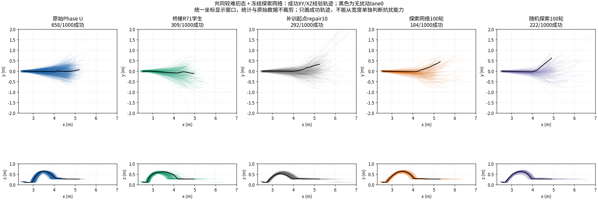
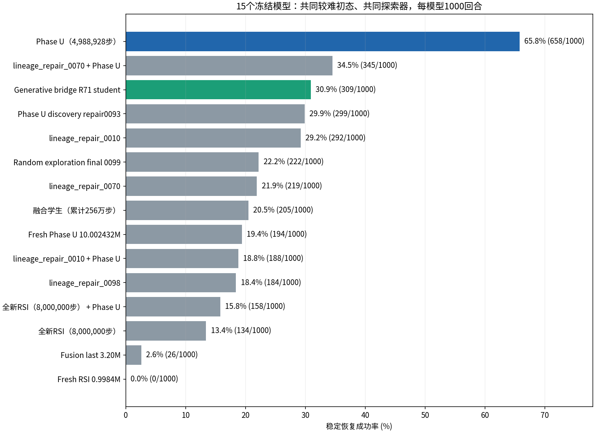
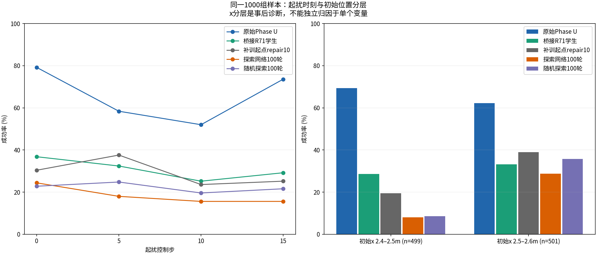
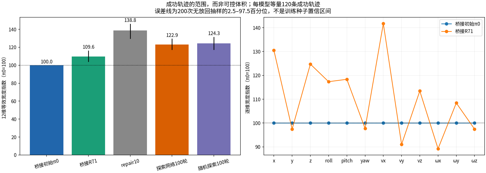
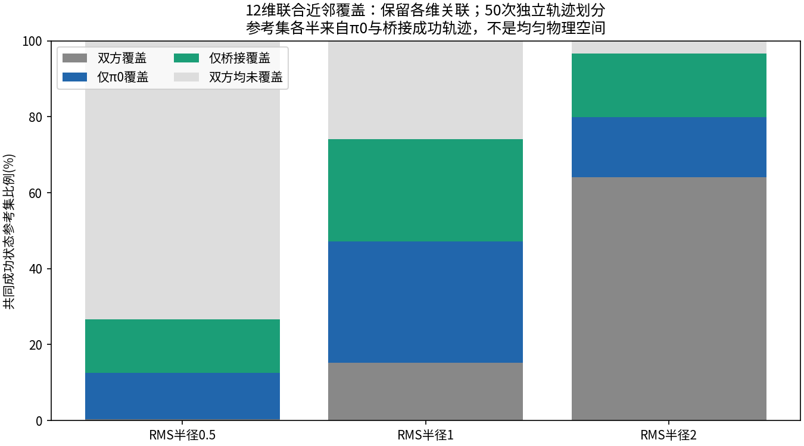

# 困难初态抗扰与12维成功包线对比

2026-10-10 · DVGC/JIT · 已完成评估的精简证据包。先看真实成功轨迹：

## 主要结果

桥接R71在这组困难初态下的成功率为 **30.9%**，桥接初始π0直接复测为 **65.1%**，下降 **34.2个百分点**。R71新增成功84回合，但丢失π0原有成功426回合；配对bootstrap 95%区间为[-38.0,-30.3]个百分点。

R71成功轨迹的12维等效宽度指数为 **109.6（π0=100）**，典型宽度约增加9.6%，但这不是可控体积增长。不同方向有增有减，联合近邻覆盖排名随尺度变化；目前只能说成功轨迹略宽、分布不同，不能说控制范围全面包住π0，更不能说整体抗扰能力更强。

## 做了什么实验

1. 15个冻结模型各1000个计分回合，共15000回合。
2. 再直接加载桥接初始化保存的π0，新增1000回合；比较中的R71和原Phase U各1000回合复用第一项，没有重跑。
3. 从已有成功轨迹计算12维包线，零新增仿真。

总计新增16000个计分回合，另有4000个名义初态并行副本，正式计费控制转移8000000（含补齐）；工程预检4800转移，零训练更新。名义副本每模型只有一个独特初态，不是250个独立条件。本包中的R71是评估时冻结快照，不表示发布时正在训练的最新模型。

### 共同评估条件

- 初态种子10102026；x=2.5±0.10m、y=0±0.05m；侧倾/俯仰/偏航各±3°。
- 前向速度2±0.20m/s、横向速度0±0.20m/s；车体局部三轴角速度各±0.10rad/s；不额外扰动竖直/关节速度。高度按接触可行性处理，实际1000个样本高度修正均为0。
- 同一个冻结探索网络（round0099）给所有模型施扰。四起扰步0/5/10/15各250回合，四动作通道归一化残差±0.25，持续3步，控制周期0.02s，最多400步。
- 成功要求有效落地后连续25步（0.5秒）稳定前进：vx≥0.5m/s、侧倾≤10°、俯仰≤15°，轮间隙≤0.02m、穿透≤0.01m，并满足无车体碰撞/后退/非有限等条件。35°侧倾物理终止阈值与10°稳定门槛不同。
- 初态与采样种子配对；**探索器会读取不同模型产生的状态，因此实际扰动序列不同**。这是共同自适应施扰协议，不是完全相同外力的单因素消融。成功也不要求回到原路径。

## 15模型结果

| 模型 | 成功数 | 成功率 |
|---|---:|---:|
| Phase U（4,988,928步） (`phase_u`) | 658/1000 | 65.8% |
| lineage_repair_0070 + Phase U (`repair_0070_phase_u`) | 345/1000 | 34.5% |
| Generative bridge R71 student (`bridge_latest`) | 309/1000 | 30.9% |
| Phase U discovery repair0093 (`discovery_0093`) | 299/1000 | 29.9% |
| lineage_repair_0010 (`baseline`) | 292/1000 | 29.2% |
| Random exploration final 0099 (`random_0099`) | 222/1000 | 22.2% |
| lineage_repair_0070 (`repair_0070`) | 219/1000 | 21.9% |
| 融合学生（累计256万步） (`student_2560000`) | 205/1000 | 20.5% |
| Fresh Phase U 10.002432M (`phase_u_10m`) | 194/1000 | 19.4% |
| lineage_repair_0010 + Phase U (`baseline_phase_u`) | 188/1000 | 18.8% |
| lineage_repair_0098 (`repair_0098`) | 184/1000 | 18.4% |
| 全新RSI（8,000,000步） + Phase U (`fresh_rsi_phase_u`) | 158/1000 | 15.8% |
| 全新RSI（8,000,000步） (`fresh_rsi`) | 134/1000 | 13.4% |
| Fusion last 3.20M (`fusion_last`) | 26/1000 | 2.6% |
| Fresh RSI 0.9984M (`fresh_rsi_1m`) | 0/1000 | 0.0% |

旧100轮两组共用的起点是repair10：29.2%；学习探索组18.4%，随机探索组22.2%。两组均未保留起点在该困难分布上的成功率；随机组比学习组高3.8个百分点。另一个discovery0093来自原Phase U训练线，不要与repair10起点的学习100轮混为一组。

repair70 + Phase U为34.5%，但同一名义初态的并行副本0/250成功，不能只按困难初态排名就采用。原Phase U为65.8%，与桥接π0参数相同，但π0直接加载复测为65.1%：33个回合标签不同。两次初态、首步动作一致，首步物理输出已有微小数值差；不把0.7个百分点误称训练收益或参数变化。

repair10及其后代对初始x更敏感。例如学习100轮在x<2.5m的499回合中成功40个，而x≥2.5m的501回合中成功144个。支持进一步检查起跳时机/训练初态覆盖的必要性，尚不能单凭分组断言原因。

## 12维范围如何量化

维度为位置x/y/z、roll/pitch/yaw、vx/vy/vz及局部三轴角速度。按reset→离地、离地→首次有效接触、接触→真实终点三个阶段各插值16点，三阶段等权；角度沿轨迹展开。离地诊断为双轮间隙连续3帧>0.01m，不修改原成功标签。

每模型每起扰时刻无放回抽30条成功轨迹，共120条；重复200次。每维每相位计算q95−q05宽度w。每次指数为 `100 * exp(mean(log(max(w_model, epsilon)/max(w_pi0, epsilon))))`，平均覆盖12维×48点，再取200次中位数。epsilon为位置0.0005m、角度0.03°、速度/角速度0.002相应单位。

| 模型键 | 成功率 | 宽度指数（π0=100） | 抽样2.5–97.5百分位 |
|---|---:|---:|---:|
| bridge_pi0 | 65.1% | 100.0 | 100.0–100.0 |
| bridge_latest | 30.9% | 109.6 | 103.8–116.3 |
| baseline | 29.2% | 138.8 | 129.6–146.1 |
| repair_0098 | 18.4% | 122.9 | 117.0–129.6 |
| random_0099 | 22.2% | 124.3 | 117.1–131.5 |

R71的x、vx、z方向指数约130.5、141.8、124.7，y、vy、yaw约97.4、91.0、97.7。分阶段指数为起跳前102.7、飞行113.8、接触后112.2。全程统一进度但不按事件对齐时为121.9，说明对齐和阶段权重会影响数字。误差带是样本抽取敏感性，不是独立训练种子的置信区间。物理宽度数据是同相位轨迹厚度，不是峰值跳高或可接受初态误差。

### 联合范围的补充检查

对π0和R71各抽120条支持轨迹、80条不重叠查询成功轨迹，50次划分；在47个非初始相位上计算12维归一化RMS近邻距离。共同尺度：位置0.05m、角度3°、线/角速度0.2。查询分布两模型各半，并非物理空间均匀采样。

半径1时π0覆盖47.1%，R71覆盖42.3%；仅π0覆盖31.9%，仅R71覆盖27.0%。半径0.5和2时排名反转，没有不依赖尺度的联合范围优势。近邻覆盖不等于未测状态可控。

12维仍是完整动力学状态的投影，遗漏关节状态和控制历史；轨迹宽也可能表示跟踪更松。下一步应在候选新增区域恢复相同完整状态、撤去探索器后做配对恢复测试，才可判断是否新增真实恢复能力；该实验尚未执行。

## 数据和复核入口

- [15模型结果CSV](data/model_results.csv)、[原汇总JSON：分组/失败终点/配对差异](data/all_models_summary.json)
- [π0直接复测及配对增失](data/pi0_comparison.json)、[π0参数身份](data/pi0_identity.json)、[数值重复差异](data/numerical_repeat.json)
- [包线指数CSV](data/envelope_indices.csv)、[完整量化汇总及尺度敏感性](data/envelope_summary.json)、[各维典型物理宽度](data/typical_dimension_widths.json)
- [冻结模型身份与checkpoint来源](data/model_identities.json)、[协议/成本/来源目录](data/protocol.json)、[文件来源及SHA-256](manifest.json)

数据中的服务器绝对路径仅是溯源标识；报告所有可点击数据/图片链接均为包内相对路径。只上传摘要和PNG，不上传权重、完整轨迹或重复PDF/ZIP；完整重算包线仍需要服务器原始NPZ。所有结论是该开发压力测试分布上的证据，不是物理可达域认证或独立训练重复结论。原始运行记录保持不变。
