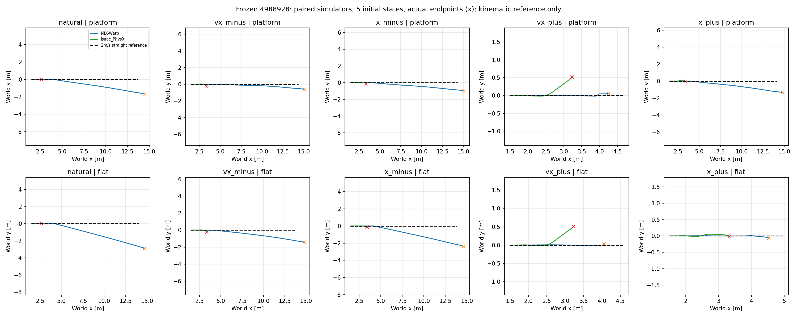
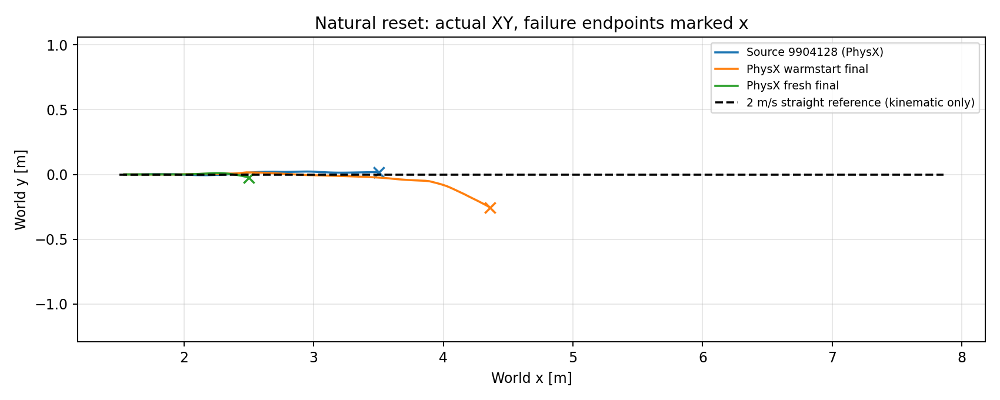
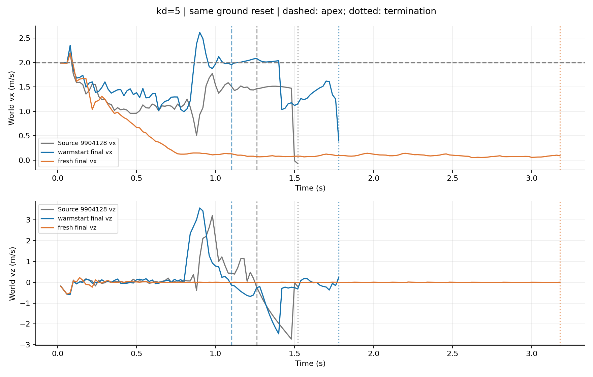
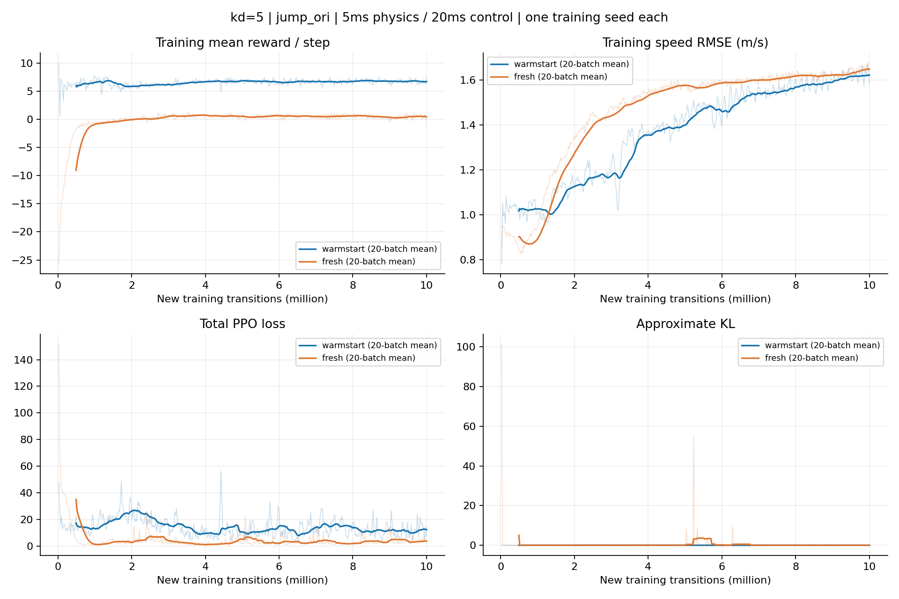

# MuJoCo/MJX → Isaac Sim/PhysX：模型、参数与 PPO 实验

交付日期：2026-10-09。只包含模型、代码快照、数值数据和 PNG；无视频。此次只归档和导出模型，没有训练或重跑运动。全部结果为工程/开发证据。

## 先看轨迹与训练结果

上图为历史冻结 4988928 的两引擎对照，下面为 9904128 及两轮 PPO 的最终 PhysX 对照；不同 checkpoint 面板不混作单因素对照。

[高度、姿态、每步及累计奖励](results/kd5/paired_diagnostics.png)。三条最终轨迹均在 PhysX 中评估，Source 9904128 表示未经目标域续训的源策略，不表示该曲线来自 MJX。蓝虚线参考仅是从初始位置以 2 m/s 前进的几何参考，不是可行性或奖励目标更改。

## 模型与详细参数

- MuJoCo/MJX：[MJCF](models/mjx/model/source.xml)、[完整 mesh](models/mjx/model/meshes)、[编译后的逐刚体/关节/执行器/碰撞参数](models/mjx_compiled_parameters.json)、[冻结环境及奖励实现](models/mjx/jit_dvgc)、[jump_ori 身份](models/mjx/jump_ori_manifest.json)。原 XML 字节保留；XML 默认 1 ms，实际环境 constants 为 sim_dt=5 ms、ctrl_dt=20 ms。
- Isaac/PhysX：[可直接打开的 USD](models/physx/bike_kd5.usdc)、[实际训练转换与控制代码](models/physx/runtime)、[导出审计](models/physx/usd_export_audit.json)、[原训练实际物理审计](ppo/warmstart_kd5/runtime_audit.json)。USD 是从冻结训练构建器导出的单车模型，不含 384 个训练副本；髋膝需要代码中的显式 PD，单独打开 USD 不会自动执行策略。
- [PhysX 完整配置（奖励、reset、PPO、驱动）](ppo/warmstart_kd5/config.json)、[fresh 配置](ppo/fresh_kd5/config.json)、[源 9904128 完整配置](ppo/mjx_source_9904128/resolved_config.json)。所有参数以各实验配置及 runtime audit 为准，不把当前参数倒写进旧实验。

| 项目 | MuJoCo/MJX 源端 | 最终 kd=5 PhysX |
|---|---|---|
| 实际物理/控制步长 | 5 / 20 ms | 5 / 20 ms |
| 积分/求解 | RK4、Newton；完整见参数 JSON | PhysX；关节位置/速度迭代 16/4 |
| 后轮驱动 kp/kd | 0/5 | 0/5，原生隐式 drive |
| 转向 kp/kd | 10/0.1 | 2.5/0.4，原生隐式 drive |
| 髋膝 kp/kd | 100/6，±30 Nm | 100/6，显式限幅 PD ±30 Nm |
| 摩擦 | 成对接触含独立切向系数；见 contact_pairs | 标量轮接触 0.5，min combine，不能原生复现源端双切向系数 |
| Actor / Critic | 76 / 106 维 | 76 / 106 维，三层 256 |
| 动作 | steer、rear、hip、knee | 相同顺序；最终训练无 PI / 固定输出覆盖 |
| 初态 | natural root=(1.5,0,0.15)m，vx=2m/s；混合 airborne RSI | 相同任务 reset，airborne RSI 概率 0.08 |

PPO：384 环境、64 步 rollout、24 minibatch、每批 8 轮、学习率 1e-4、clip 0.2、gamma 0.99、GAE 0.95、entropy 0.01、reward scaling 0.1、max grad norm 0.5；每轮 407 批、10,002,432 新增控制转移。详见完整 JSON，不以此表代替完整配置。

## PPO 训练与最终结果

| 模型 | 初始化 | 新增步数 | 自然初态顶点 | 最高 root z | 终止 |
|---|---|---:|---:|---:|---|
| Source 9904128 | MJX 源策略 | 目标域 0 | 1.26 s | 0.561 m | 1.52 s 侧倾 |
| warmstart final | 源 Actor/Critic/归一化；Adam 重新初始化 | 10,002,432 | 1.10 s | 0.571 m | 1.78 s 侧倾 |
| fresh final | 网络、Adam、归一化从零 | 10,002,432 | 无 | 0.150 m | 3.18 s 停滞 |

两轮均完成预算，分别约 4.72 h / 4.60 h。续训另有源端 9,904,128 步经验，不是等总成本的从零对照。最终评估为同一自然初态、每个模型一回合、确定性策略；没有多 seed 成功率结论。达到顶点不等于平稳落地，三条均未证明稳定落地。

- [逐例指标](results/kd5/evaluation_summary.json)、[训练摘要](results/kd5/training_summary.json)、[末 100 万步回合分组](results/kd5/training_last1m_episodes.json)、[KL 尖峰](results/kd5/kl_audit.json)。从零末段 ground 4128 回合均无顶点；airborne 顶点不能解释为学会地面起跳。
- [warmstart 全部训练标量](ppo/warmstart_kd5/metrics.jsonl)、[fresh 全部训练标量](ppo/fresh_kd5/metrics.jsonl)。各目录 episodes.jsonl.gz 是完整原始回合日志的无损压缩，非采样摘要。
- [warmstart 最终 Actor/learner/归一化](ppo/warmstart_kd5/checkpoint_final)、[fresh 最终权重](ppo/fresh_kd5/checkpoint_final)、[9904128 源 checkpoint](ppo/mjx_source_9904128/checkpoint)、[4988928 历史冻结 checkpoint](ppo/mjx_source_4988928/checkpoint)。最终权重不称 best；训练没有全程固定开发评估选 best。
- [warmstart 逐步 NPZ/JSON](evaluation/warmstart_kd5)、[fresh 逐步 NPZ/JSON](evaluation/fresh_kd5)、[紧凑逐步 CSV](results/kd5)。保留原始终止，未补齐失败后的曲线。
- [更早停止/替换的训练配置、状态与标量](ppo/earlier)。这些历史运行不冒充已完成的 1000 万步实验。

## 迁移与后续诊断的精简索引

| 实验 | 做了什么 / 结论边界 | 数值与图 |
|---|---|---|
| 4988928 frozen fast path | paired 首分歧、gyro/acc 对齐、后轮/转向阶跃、摩擦筛选、8 组合消融；旧 PhysX 1 ms vs MJX 5 ms，不能称同物理步长 | [首分歧/观测/动作/执行器/接触/消融 CSV](history/sim2sim_fast_path_20260928/analysis)、[自然初态双引擎图](history/sim2sim_fast_path_20260928/analysis/closed_loop_natural.png) |
| 同步长复核 | 双方 5/20 ms；原报告记录 4/5 顶点，20 ms 平均加速度适配为 1/5。旧 1 ms 适配不直接迁移到 5 ms | [结果 CSV](history/review_corrections_20260928/outcomes.csv)、[原始记录](history/review_corrections_20260928/records.json) |
| 平台移除 | 同时比较 MJX 与 PhysX、有台阶/无台阶，移除平台未证明解决正常落地 | [全部配对数据及 natural 图](history/platform_removal_20260928/analysis) |
| 固定后轮输出及增益筛查 | 寻找 2 m/s 输入；不是 PPO，也不是完整冻结四路输出的迁移 | [原始数据](history/rear_speed_search_20260928)、[固定 2m/s 几何换算试验](history/fixed_rear_2mps_20260928) |
| 后轮 PI / 稳速后放行 | 用户批准的工程干预；Actor 权重冻结但后轮动作被闭环替换，不等同原策略端到端成功 | [配对 CSV / natural 图](history/rear_speed_closedloop_20260928/analysis) |

历史小型 JSON 合并为各目录 records.json，键保留原相对路径；NPZ 仍保存原始数组。首分歧旧协议五例首 tick=1，frame2.angular_velocity_y，动作和状态也在 tick1 首次越阈值；不能仅据最终视频判断根因。各协议/阈值/实际读回详见 records.json；历史 task_success 字段常表示 apex，不能解读为落地。

## 使用与核验

1. 模型查看：MuJoCo 加载 models/mjx/model/source.xml；要复现实验必须由环境设置实际 5 ms 步长。Isaac Sim 打开 models/physx/bike_kd5.usdc；控制及动作映射见 runtime/physx_task.py 和 policy_runtime.py。
2. 训练重现入口为冻结 runtime/train_physx_brax.py；需要按本机安装位置设置源码/配置路径。归档保留原绝对路径用于溯源，未承诺在任意机器上开箱训练。源运行 JAX/Brax/Flax/Optax 版本见 checkpoint identity.json；Isaac Sim 5.1。
3. 两套模型共用源 mesh，PhysX MJCF 的 meshdir 仅为相对路径重定位；质量/关节/接触参数未作外观修饰。训练当时的代码保留，后续 knee 平移/拉长和末姿态回正示意均未纳入结果。
4. [文件身份与校验](manifest.json)、[打包验证](validation.json)、[原路径映射](source_map.json)。模型导出只加载/转换，不执行物理轨迹；全部 PNG 来自已保存数值。

下一步建议：先用固定小面板隔离“确定性/采样动作”和“单环境/训练布局”的差异，再决定 PPO 改动；本次没有新增训练。
